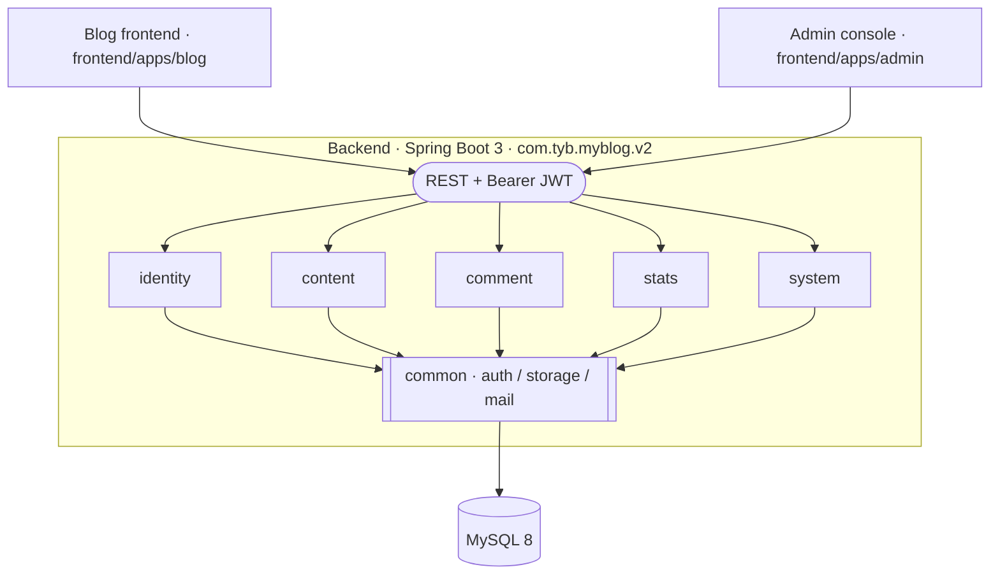
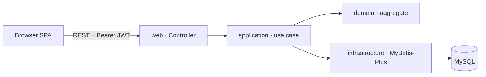

# MyBlog V2

[简体中文](./README.md) | **English** | [日本語](./README.ja.md)


A personal blog system built as a modular monolith. The backend runs on Spring Boot 3 + Java 17; the frontend is split into two independent Vue 3 apps — a public blog and an admin console. V2 is the only maintained mainline and is deployed at the [public blog](https://tong-yibin.com) and [admin console](https://admin.tong-yibin.com). V1 lives only on the read-only `archive/v1-master-2026-06-26` branch.

<sub>
  <a href="#overview">Overview</a> ·
  <a href="#origins">Origins</a> ·
  <a href="#architecture">Architecture</a> ·
  <a href="#technology-choices">Technology choices</a> ·
  <a href="#directory-layout">Directory layout</a> ·
  <a href="#running-locally">Running locally</a> ·
  <a href="#database">Database</a> ·
  <a href="#tests-and-verification">Tests and verification</a> ·
  <a href="#production-delivery">Production delivery</a> ·
  <a href="#documentation">Documentation</a> ·
  <a href="#relationship-to-v1">Relationship to V1</a> ·
  <a href="#license">License</a>
</sub>

## Overview

- **Shape**: a single Spring Boot backend + two independently deployed SPA frontends.
- **Architectural style**: modular monolith. The business is sliced into five bounded contexts, and the direction of dependencies between modules is enforced by ArchUnit tests.
- **Contract boundaries**: each module is organised into `web / application / domain / infrastructure`; the outward contract is REST + JWT, with public endpoints declared explicitly in configuration.
- **Persistence**: MySQL + MyBatis-Plus, with schema evolution managed by Flyway.
- **Single-box friendly**: no runtime dependency on Redis / RabbitMQ / Elasticsearch / Quartz — JDK 17, Node 24, and MySQL are enough to bring the whole stack up locally.

### Current capabilities

- **Public blog**: every public page uses a `/zh`, `/ja`, or `/en` prefix. Home, articles, categories, tags, archives, search, about, friend links, guestbook, and comments are available; PASSWORD articles exchange a password for a short-lived access token through a dedicated unlock API.
- **Content orchestration**: draft, published, private, password-protected, and scheduled states; the homepage supports one pinned article, up to two featured articles, and the regular list.
- **Admin console**: articles, homepage slots, categories and tags, comments, friend links, attachments, site configuration, author profile, password changes, and the statistics dashboard.
- **Identity and data**: ADMIN/DEMO permissions, JWT access tokens, database-backed refresh-token rotation and revocation; Flyway V1–V6 manages 16 tables with consistent soft-delete, audit, and `Asia/Tokyo` time rules.
- **Delivery**: GitHub Actions runs backend, real-MySQL, Linux PowerShell, blog, and admin CI. `main` publishes GHCR images tagged with the same commit SHA and deploys them automatically to AWS EC2.

## Origins

The three tiers of V2 each start from a different place and make different trade-offs:

- **Backend**: inspired by [`aurora-springboot`](https://github.com/linhaojun857/Aurora) — a feature-complete but heavyweight blog backend (Spring Boot 2 + Spring Security + Redis + RabbitMQ + Elasticsearch + Quartz + AWS S3). V2 keeps the same domain slicing (content / comment / identity / system / stats) but is **written from scratch**, stripping out every optional middleware. It uses self-signed JWT + Caffeine in-process cache + Flyway migrations + pluggable local/S3 storage, with the goal of "runs on a single machine, module boundaries enforced by tests".
- **Blog frontend**: derived from [`auroral-ui/hexo-theme-aurora`](https://github.com/auroral-ui/hexo-theme-aurora) — a Vue 3 blog theme originally embedded inside Hexo. The upstream build chain is tightly coupled to the Hexo static generator and pulls in CDN references to several comment plugins (gitalk / valine / twikoo / waline), leaving a wide configuration surface. V2 **extracts it from Hexo into a standalone SPA**: the Hexo integration layer and redundant comment plugins are removed, the `templates/*` files and `server.proxy` Hexo dev-server bindings are cleaned up, Vite / TypeScript / dependencies are upgraded, and the data source is switched from `hexo-generator-json` static JSON to the project's own REST API.
- **Admin console**: introduced as a snapshot of the [`pure-admin-thin`](https://github.com/pure-admin/pure-admin-thin) scaffold, then trimmed and extended with views and API clients that match the backend.

## Architecture

### Big picture



### Backend modules

The backend root package is `com.tyb.myblog.v2` — five business modules plus one shared module:

| Module     | Responsibility                                                          |
| ---------- | ----------------------------------------------------------------------- |
| `identity` | Users, roles, permissions, authentication, JWT issuance                 |
| `content`  | Articles, categories, tags, including scheduled publishing              |
| `comment`  | Article comments and guestbook, including keyword moderation            |
| `stats`    | Page-view tracking and aggregation jobs                                 |
| `system`   | Site configuration, friend links, media upload and other ops            |
| `common`   | Cross-module infrastructure: auth, errors, storage, security, web, mail |

Each business module has a fixed internal layering:

```
<module>/
├─ web            # Controllers / DTOs / request-response contracts
├─ application    # Use-case orchestration, transactional boundaries, cross-aggregate coordination
├─ domain         # Domain model and domain services
└─ infrastructure # MyBatis-Plus mappers, external adapters
```

`ArchitectureRulesTest` uses ArchUnit to enforce: no undeclared dependencies between modules; the `domain` layer must not contain Spring/MyBatis symbols; the token port in `common.auth` cannot be referenced directly by business modules or by Spring Security. Any drift from these rules causes `mvn test` to fail.

### Request path



The `application` layer owns the `@Transactional` boundary and cross-aggregate coordination. Public endpoints (no authentication required) are declared centrally in `application.yml` under `myblog.security.public-endpoints`; everything else defaults to requiring JWT.

### Frontend split

- `frontend/apps/blog`: the visitor-facing public blog. Stack: Vue 3 + Vite + TypeScript + Pinia + Vue Router 4 + vue-i18n + markdown-it. Source is organised into `pages / components / features / shared / stores`. It originated from the Hexo theme `hexo-theme-aurora`, with the Hexo runtime removed (see “Origins”).
- `frontend/apps/admin`: the operator-facing admin console. Built on the `pure-admin-thin` template, using Vue 3 + Vite + TypeScript + Element Plus + Tailwind CSS + Pinia, with Vitest for unit tests.

Both frontends build and deploy independently, and talk to the same backend over REST.

## Technology choices

| Layer              | Choice                              | Notes                                                                                              |
| ------------------ | ----------------------------------- | -------------------------------------------------------------------------------------------------- |
| Runtime            | Java 17 / Node 24                   | Enforced by Maven Enforcer, frontend `engines`, and CI                                             |
| Backend framework  | Spring Boot 3.5                     | Servlet + Spring Security + Validation                                                             |
| Persistence        | MyBatis-Plus 3.5 + MySQL 8          | Hand-written SQL mixed with a lightweight ORM                                                      |
| Migrations         | Flyway                              | `db/migration/V*__*.sql`, applied on startup                                                       |
| Auth               | JWT access + database refresh token | Rotation, logout, and password-change revocation; short-lived article tokens for PASSWORD content  |
| Rate limiting      | Caffeine in-process cache           | Single-instance controls for login failures, comment frequency/duplicates, and page-view recording |
| Mail               | Resend HTTP API                     | Disabled by default, opt-in                                                                        |
| Storage            | LOCAL / AWS S3 pluggable            | Switched by `myblog.storage.type`                                                                  |
| Content            | Commonmark + OWASP HTML Sanitizer   | Markdown rendering and XSS sanitisation                                                            |
| Mapping            | MapStruct + Lombok                  | Conversion between DTOs / domain / persistence objects                                             |
| Architecture tests | ArchUnit                            | Module boundaries and dependency direction                                                         |
| API docs           | Springdoc / Knife4j                 | Disabled by default, opt-in locally                                                                |
| Deployment         | Docker Compose + Caddy + GHCR       | Single AWS EC2 instance, Route 53 domains, and S3 object storage                                   |

## Directory layout

```
My-Blog
├─ MyBlog-springboot-v2/           # V2 backend (current mainline)
│  ├─ src/main/java/com/tyb/myblog/v2/
│  ├─ src/main/resources/
│  │  ├─ application.yml           # Baseline configuration
│  │  ├─ application-local.yml     # Local profile
│  │  ├─ db/migration/             # Flyway SQL
│  │  └─ mapper/                   # MyBatis XML
│  ├─ scripts/                     # Local helper scripts
│  └─ .env.example                 # Required environment variables
├─ frontend/
│  └─ apps/
│     ├─ blog/                     # V2 public blog
│     └─ admin/                    # V2 admin console
├─ deploy/                         # Web image, Caddy, and production resources
├─ docs/                           # Current handbook, governance, product, and showcase docs
└─ .github/workflows/              # CI and same-SHA image publication/deployment
```

## Running locally

### Prerequisites

- JDK 17
- Maven 3.9+
- Node 24, with pnpm 9 enabled via `corepack`
- MySQL 8, with a local database `myblog_v2_dev` (Flyway takes care of tables and migrations)

### Environment variables

The backend reads the following (see `MyBlog-springboot-v2/.env.example`):

<details>
<summary>Expand variable list</summary>

```
MYBLOG_DATASOURCE_USERNAME=root
MYBLOG_DATASOURCE_PASSWORD=<your local MySQL password>
MYBLOG_JWT_SECRET=<random string, at least 32 chars>
MYBLOG_STATS_HASH_SECRET=<random string, at least 32 chars>
```

</details>

Real secrets are injected via local environment variables or IDE run configurations; production values are never stored in the repo.

> [!IMPORTANT]
> `MYBLOG_JWT_SECRET` and `MYBLOG_STATS_HASH_SECRET` **must** be replaced with high-entropy random strings in production. The sample values are for local development only — leaking them is equivalent to being able to forge any user's session.

### Start all three

```powershell
# Backend
cd MyBlog-springboot-v2
mvn spring-boot:run -Dspring-boot.run.profiles=local

# Blog frontend
cd frontend/apps/blog
corepack pnpm install --frozen-lockfile
corepack pnpm dev

# Admin console
cd frontend/apps/admin
corepack pnpm install --frozen-lockfile
corepack pnpm dev
```

Default listening addresses:


## Database

- Migration scripts live under `MyBlog-springboot-v2/src/main/resources/db/migration/`. The current schema is Flyway V1–V6 with 16 tables, using the `V<version>__<description>.sql` naming convention.
- The backend applies any unapplied migrations on startup; no manual SQL import is needed.
- Timezone is fixed to `Asia/Tokyo`; the MySQL connection string and Jackson serialisation both align with it.

> [!WARNING]
> The timezone is a hard constraint. If the deployment host, the MySQL server timezone, or the application configuration diverge from `Asia/Tokyo` in any one place, publication timestamps, comment times, and aggregated stats will drift in ways that are hard to catch.

## Tests and verification

| Command                                                                          | Coverage                                                |
| -------------------------------------------------------------------------------- | ------------------------------------------------------- |
| `mvn clean test`                                                                 | Backend unit/integration tests and ArchUnit constraints |
| `pwsh -File MyBlog-springboot-v2/scripts/dev/mysql/initialize.contract-test.ps1` | Safety contract for the local MySQL initializer         |
| `corepack pnpm --dir frontend/apps/blog test`                                    | Blog Vitest suite                                       |
| `corepack pnpm --dir frontend/apps/blog typecheck`                               | Blog TypeScript + Vue TSC                               |
| `corepack pnpm --dir frontend/apps/blog build`                                   | Blog production build and chunk budget                  |
| `corepack pnpm --dir frontend/apps/admin test`                                   | Admin Vitest suite                                      |
| `corepack pnpm --dir frontend/apps/admin typecheck`                              | Admin TypeScript + Vue TSC                              |
| `corepack pnpm --dir frontend/apps/admin build`                                  | Admin production build                                  |

Any change that touches module boundaries or cross-module dependencies must treat the backend ArchUnit result as a gate. A separate Testcontainers job in CI verifies MySQL 8.4 dialect, migrations, and concurrency behavior.

## Production delivery

The `main` workflow builds separate API and Web images and uses only the full commit SHA as the GHCR tag. Deployment obtains temporary AWS permissions through GitHub OIDC, opens Runner SSH `/32` only for the deployment, and updates Docker Compose with the same SHA. It then checks the API Actuator endpoint and requires the blog, `www`, and admin HTTPS `/healthz` endpoints to return the fixed body `ok`; temporary ingress is always revoked afterward.

The authoritative production architecture, environment-variable contract, first deployment, routine release, recovery, and rollback procedures live under [`docs/handbook/ops/`](docs/handbook/ops/README.md). Real IPs, resource IDs, passwords, keys, and complete production environment values are never stored in the repository.

## Documentation

- [Documentation entry point](docs/README.md)
- [Current status](docs/handbook/start-here/current-status.md)
- [Open issues](docs/handbook/start-here/open-issues.md)
- [API contracts](docs/handbook/api/README.md)
- [Product specifications](docs/handbook/product/README.md)
- [Operations, verification, and release](docs/handbook/ops/README.md)

## Relationship to V1

> [!NOTE]
> The current mainline no longer contains V1 directories or compatibility layers. Use the read-only `archive/v1-master-2026-06-26` branch when comparing the old implementation or schema.

- V1 is itself a fork of upstream projects [`aurora-springboot`](https://github.com/linhaojun857/Aurora) / [`aurora-blog`](https://github.com/auroral-ui/hexo-theme-aurora), with a runtime that depends on Spring Security / Redis / RabbitMQ / Elasticsearch / Quartz / AWS S3 — feature-rich but heavy.
- V2 does not reuse V1's runtime dependencies, nor its database schema. The two schemas are independent; when data needs to be migrated it is done via a one-shot SQL script, not by running both side by side.

## License

This repository is licensed under [MIT](./LICENSE).

- `frontend/apps/blog` is derived from [`auroral-ui/hexo-theme-aurora`](https://github.com/auroral-ui/hexo-theme-aurora) (MIT); its original [`LICENSE`](./frontend/apps/blog/LICENSE) and copyright notice are preserved.
- `frontend/apps/admin` is based on the [`pure-admin/pure-admin-thin`](https://github.com/pure-admin/pure-admin-thin) (MIT) scaffold; its original [`LICENSE`](./frontend/apps/admin/LICENSE) and copyright notice are preserved.
- The backend only borrows the domain slicing from [`linhaojun857/Aurora`](https://github.com/linhaojun857/Aurora) (Apache-2.0); the code itself is written from scratch in this repository.
