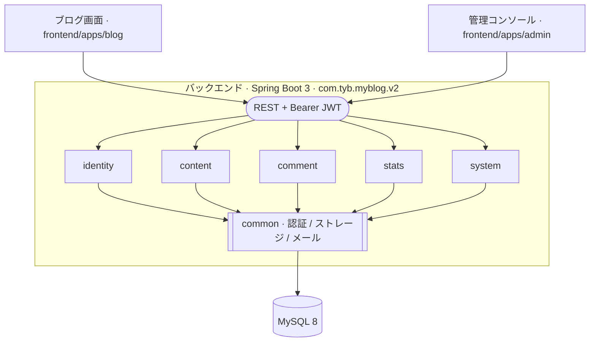
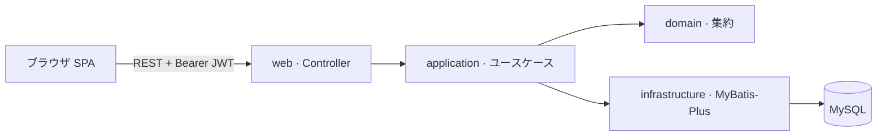

# MyBlog V2

[简体中文](./README.md) | [English](./README.en.md) | **日本語**


モジュラーモノリスとして構築した個人ブログシステム。バックエンドは Spring Boot 3 + Java 17、フロントエンドはブログ公開画面と管理コンソールという 2 つの独立した Vue 3 アプリに分割している。V2 が現在のメインラインで、V1（Spring Boot 2 + Vue 3 ブログ / Vue 2 管理）はアーカイブとしてリポジトリに残しているだけである。

<sub>
  <a href="#概要">概要</a> ·
  <a href="#由来">由来</a> ·
  <a href="#アーキテクチャ">アーキテクチャ</a> ·
  <a href="#技術選定">技術選定</a> ·
  <a href="#ディレクトリ構成">ディレクトリ構成</a> ·
  <a href="#ローカル起動">ローカル起動</a> ·
  <a href="#データベース">データベース</a> ·
  <a href="#テストと検証">テストと検証</a> ·
  <a href="#v1-との関係">V1 との関係</a> ·
  <a href="#license">License</a>
</sub>

## 概要

- **形態**：単一の Spring Boot バックエンド + 独立デプロイの SPA フロントエンド 2 つ。
- **アーキテクチャ様式**：モジュラーモノリス。業務を境界づけられたコンテキストで 5 つのモジュールに分割し、モジュール間の依存方向は ArchUnit テストで強制する。
- **契約境界**：モジュール内部は `web / application / domain / infrastructure` の 4 層で構成。対外的には REST + JWT で提供し、公開エンドポイントは設定に明示的に宣言する。
- **永続化**：MySQL + MyBatis-Plus。スキーマ進化は Flyway が管理する。
- **動かしやすさ優先**：Redis / RabbitMQ / Quartz など外部ミドルウェアへの依存なし。JDK 17、Node 20+、MySQL があればローカルで一式起動できる。

## 由来

V2 の 3 つのティアはそれぞれ出発点が異なり、トレードオフの取り方も違う。

- **バックエンド**：[`aurora-springboot`](https://github.com/linhaojun857/Aurora) から着想を得ている。機能は揃っているが依存の重いブログバックエンド（Spring Boot 2 + Spring Security + Redis + RabbitMQ + Elasticsearch + Quartz + AWS S3）である。V2 はドメイン分割の考え方（コンテンツ / コメント / ユーザー権限 / サイトシステム / 統計）を引き継ぎつつ、コードは**ゼロから書き起こし**、オプションのミドルウェアはすべて剥がした。自己署名 JWT + Caffeine のインプロセスキャッシュ + Flyway マイグレーション + ローカル/S3 の差し替え可能ストレージという構成で、目標は「1 台のマシンで動く、モジュール境界がテストで固定される」ことにある。
- **ブログフロントエンド**：[`auroral-ui/hexo-theme-aurora`](https://github.com/auroral-ui/hexo-theme-aurora) を起点にしている。Vue 3 で書かれてはいるが、元は Hexo に組み込まれるブログテーマである。上流のビルドチェーンは Hexo の静的ジェネレータと密結合しており、gitalk / valine / twikoo / waline など複数のコメントプラグインを CDN 経由で持ち込む構成で、設定項目が多い。V2 はこれを **Hexo から独立した SPA として切り離した**：Hexo 統合層と冗長なコメントプラグインを削除、`templates/*` や `server.proxy` など Hexo dev-server 関連を整理、Vite / TypeScript / 依存関係のバージョンを更新し、データソースを `hexo-generator-json` の静的 JSON から自作バックエンドの REST API に切り替えている。
- **管理コンソール**：[`pure-admin-thin`](https://github.com/pure-admin/pure-admin-thin) をスナップショットとしてスキャフォールドに取り込み、その上でテンプレートを削り、業務に応じてビューと API クライアントを補っている。

## アーキテクチャ

### 全体像



### バックエンドのモジュール分割

バックエンドのルートパッケージは `com.tyb.myblog.v2`。業務モジュール 5 つ + 共通モジュール 1 つで構成する。

| モジュール    | 責務                                                 |
| ---------- | -------------------------------------------------- |
| `identity` | ユーザー、ロール、権限、認証、JWT 発行                    |
| `content`  | 記事、カテゴリ、タグ。予約投稿を含む                       |
| `comment`  | 記事コメントと掲示板。キーワード審査を含む                |
| `stats`    | ページビュー計測と集計処理                          |
| `system`   | サイト設定、フレンドリンク、メディアアップロードなど運用機能  |
| `common`   | モジュール横断の基盤：認証、エラー、ストレージ、セキュリティ、Web、メール |

各業務モジュールの内部は固定の階層構造を持つ。

```
<module>/
├─ web            # Controller / DTO / リクエスト・レスポンス契約
├─ application    # ユースケース編成、トランザクション境界、集約横断の調整
├─ domain         # ドメインモデルとドメインサービス
└─ infrastructure # MyBatis-Plus マッピング、外部アダプタ
```

`ArchitectureRulesTest` は ArchUnit を使って次の制約を強制する：モジュール間で規約外の相互依存を持たない、`domain` 層に Spring/MyBatis などフレームワークのシンボルを出現させない、`common.auth` のトークンポートを業務モジュールや Spring Security から直接参照させない。アーキテクチャドリフトが起きれば `mvn test` の段階で必ず失敗する。

### リクエストパス



`application` 層が `@Transactional` の境界と集約横断の調整を担う。公開エンドポイント（認証不要）は `application.yml` の `myblog.security.public-endpoints` にまとめて宣言し、それ以外は既定で JWT を要求する。

### フロントエンドの分割

- `frontend/apps/blog`：訪問者向けのブログ画面。技術スタックは Vue 3 + Vite + TypeScript + Pinia + Vue Router 4 + vue-i18n + markdown-it。ソースは `pages / features / api / stores / models` の階層で整理する。Hexo テーマ `hexo-theme-aurora` を出自とし、Hexo ランタイムはすでに剥がしている（詳細は「由来」節）。
- `frontend/apps/admin`：サイト運営者向けの管理コンソール。`pure-admin-thin` テンプレートをベースに、Vue 3 + Vite + TypeScript + Element Plus + Tailwind CSS + Pinia、単体テストは Vitest を採用する。

2 つのフロントエンドは独立してビルド・デプロイし、同一のバックエンドに REST で接続する。

## 技術選定

| レイヤ       | 選定                                | 補足                                       |
| ---------- | --------------------------------- | ---------------------------------------- |
| ランタイム     | Java 17 / Node 20+                | Maven Enforcer と `engines` フィールドで制約     |
| バックエンドFW  | Spring Boot 3.5                   | Servlet + Spring Security + Validation   |
| 永続化        | MyBatis-Plus 3.5 + MySQL 8        | 手書き SQL と軽量 ORM の組み合わせ                |
| マイグレーション | Flyway                            | `db/migration/V*__*.sql`、起動時に自動実行       |
| 認証          | 自作 JWT（access + refresh）         | パラメータは `myblog.security.jwt` に集約         |
| レート制限     | Caffeine のインプロセスキャッシュ            | ログイン失敗ロックとページビューのレート制御               |
| メール         | Resend HTTP API                   | 既定で無効、必要に応じて有効化                        |
| ストレージ    | LOCAL / AWS S3 を差し替え可能            | `myblog.storage.type` で切り替え             |
| コンテンツ処理 | Commonmark + OWASP HTML Sanitizer | Markdown レンダリングと XSS サニタイズ           |
| マッピング    | MapStruct + Lombok                | DTO / ドメイン / 永続化オブジェクトの変換             |
| アーキテクチャテスト | ArchUnit                       | モジュール境界と依存方向                           |
| API ドキュメント | Springdoc / Knife4j             | 既定で無効、ローカルで必要に応じて有効化                |
| デプロイ      | AWS EC2 単一インスタンス                  | バックエンドはコンテナ化予定、現状は JAR 直起動。フロントの `dist` は nginx で静的配信 |

## ディレクトリ構成

```
My-Blog
├─ MyBlog-springboot-v2/           # V2 バックエンド（現行メインライン）
│  ├─ src/main/java/com/tyb/myblog/v2/
│  ├─ src/main/resources/
│  │  ├─ application.yml           # ベースライン設定
│  │  ├─ application-local.yml     # ローカル profile
│  │  ├─ db/migration/             # Flyway SQL
│  │  └─ mapper/                   # MyBatis XML
│  ├─ scripts/                     # ローカル補助スクリプト
│  └─ .env.example                 # 必須環境変数のサンプル
├─ frontend/
│  └─ apps/
│     ├─ blog/                     # V2 ブログフロントエンド
│     └─ admin/                    # V2 管理コンソール
├─ MyBlog-springboot/              # V1 バックエンド（アーカイブ、参考のみ）
└─ MyBlog-vue/                     # V1 フロントエンド（アーカイブ、参考のみ）
```

## ローカル起動

### 前提

- JDK 17
- Maven 3.9+
- Node 20.19+ または 22.12+、`corepack` で pnpm 9 を有効化
- MySQL 8。ローカルでデータベース `myblog_v2_dev` を用意する（テーブル作成とマイグレーションは Flyway が担当）

### 環境変数

バックエンドは以下を読み込む（詳細は `MyBlog-springboot-v2/.env.example`）。

<details>
<summary>変数リストを展開</summary>

```
MYBLOG_DATASOURCE_USERNAME=root
MYBLOG_DATASOURCE_PASSWORD=<ローカル MySQL のパスワード>
MYBLOG_JWT_SECRET=<32 文字以上のランダム文字列>
MYBLOG_STATS_HASH_SECRET=<32 文字以上のランダム文字列>
```

</details>

本番の値はローカル環境変数か IDE の実行構成で注入し、リポジトリには保存しない。

> [!IMPORTANT]
> 本番環境の `MYBLOG_JWT_SECRET` と `MYBLOG_STATS_HASH_SECRET` は必ず高エントロピーのランダム文字列に差し替えること。サンプル値はローカル開発専用で、漏洩は任意ユーザーのセッションを偽造できることに等しい。

### 3 つのアプリを起動する

```powershell
# バックエンド（既定 profile：local）
cd MyBlog-springboot-v2
mvn spring-boot:run

# ブログフロントエンド
cd frontend/apps/blog
corepack pnpm install --frozen-lockfile
corepack pnpm dev

# 管理コンソール
cd frontend/apps/admin
corepack pnpm install --frozen-lockfile
corepack pnpm dev
```

既定の待ち受けアドレス：


## データベース

- マイグレーションスクリプトは `MyBlog-springboot-v2/src/main/resources/db/migration/` に置き、Flyway 規約（`V<version>__<description>.sql`）に従う。
- バックエンドは起動時に未適用のマイグレーションを自動実行するので、手動で SQL をインポートする必要はない。
- タイムゾーンは `Asia/Tokyo` に固定。MySQL 接続文字列と Jackson シリアライズもこのタイムゾーンに揃えている。

> [!WARNING]
> タイムゾーンは強い制約である。デプロイホスト、MySQL サーバのタイムゾーン、アプリ設定のいずれか一つでも `Asia/Tokyo` から外れると、記事の公開日時、コメントのタイムスタンプ、統計集計に気付きにくいズレが生じる。

## テストと検証

| コマンド                                                  | 対象範囲                                     |
| ------------------------------------------------------- | ----------------------------------------- |
| `mvn test`                                              | バックエンド単体テスト + ArchUnit アーキテクチャ制約   |
| `mvn verify`                                            | フルビルド + パッケージング                        |
| `corepack pnpm --dir frontend/apps/blog run build`      | ブログフロントエンドのプロダクションビルド                |
| `corepack pnpm --dir frontend/apps/admin test`          | 管理コンソール単体テスト（Vitest）                  |
| `corepack pnpm --dir frontend/apps/admin run typecheck` | TypeScript + Vue TSC 型チェック               |
| `corepack pnpm --dir frontend/apps/admin run build`     | 管理コンソールのプロダクションビルド                    |

モジュール分割やモジュール間依存に触れる変更は、`mvn test` の ArchUnit 結果をゲートとする。

## V1 との関係

> [!NOTE]
> V1 ディレクトリ（`MyBlog-springboot` + `MyBlog-vue`）は比較参照とデータ移行の参考用にのみ残しており、新機能は受け付けない。完全な履歴は `archive/v1-master-2026-06-26` ブランチにある。

- V1 自体が上流の [`aurora-springboot`](https://github.com/linhaojun857/Aurora) / [`aurora-blog`](https://github.com/auroral-ui/hexo-theme-aurora) 系プロジェクトの改造版で、ランタイム依存は Spring Security / Redis / RabbitMQ / Elasticsearch / Quartz / AWS S3 と、「機能は揃うが重い」形態に属する。
- V2 は V1 のランタイム依存も、データベーススキーマも継承しない。2 つのスキーマは互いに独立しており、データ移行が必要なときは SQL スクリプトで一括で実施する。実行時に共存させることはしない。

## License

本リポジトリは [MIT](./LICENSE) で公開している。

- `frontend/apps/blog` は [`auroral-ui/hexo-theme-aurora`](https://github.com/auroral-ui/hexo-theme-aurora)（MIT）から派生しており、原本の [`LICENSE`](./frontend/apps/blog/LICENSE) と著作権表記を保持している。
- `frontend/apps/admin` は [`pure-admin/pure-admin-thin`](https://github.com/pure-admin/pure-admin-thin)（MIT）のスキャフォールドをベースにしており、原本の [`LICENSE`](./frontend/apps/admin/LICENSE) と著作権表記を保持している。
- バックエンドは業務ドメインの分割方針についてのみ [`linhaojun857/Aurora`](https://github.com/linhaojun857/Aurora)（Apache-2.0）を参考にしており、コード本体は本リポジトリでゼロから書き起こしている。
