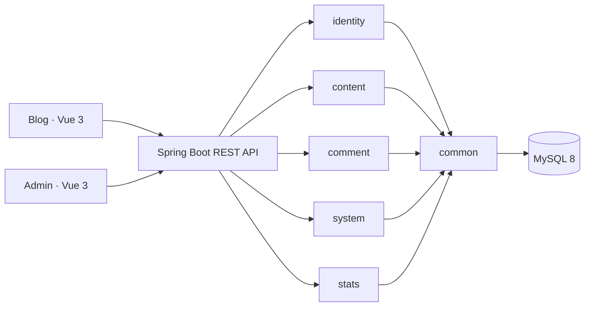

# MyBlog V2

**简体中文** | [English](README.en.md) | [日本語](README.ja.md)


MyBlog V2 是一个模块化单体个人博客系统，由 Spring Boot API、公开博客和管理后台三个可独立构建的应用组成。V2 是当前开发主线；V1 源码已从主线移除，由只读分支 `archive/v1-master-2026-06-26` 保存。

## 当前能力

- 三语博客：首页、文章详情、分类、标签、归档、搜索、关于、友链和文章评论。
- 首页编排：1 篇置顶、最多 2 篇精选和普通文章列表。
- 管理后台：文章、分类标签、评论、友链、附件、站点配置、作者资料和统计仪表盘。
- 身份与权限：ADMIN/DEMO、JWT access token、数据库 refresh token、轮换、退出和改密撤销。
- 内容与数据：Markdown、评论 HTML 清洗、Flyway V1–V4、14 张表、软删除和审计字段。
- 运维基础：local/test/prod profile、LOCAL/S3 存储、health endpoint 和 GitHub Actions CI。

当前尚未实现 PASSWORD 文章解锁和博客端留言板。实际生产服务器、代理、备份与回滚拓扑仍需确认，详见[当前状态](docs/handbook/start-here/current-status.md)和[开放问题](docs/handbook/start-here/open-issues.md)。

## 架构



后端基础包为 `com.tyb.myblog.v2`。五个业务模块内部采用 web/application/domain/infrastructure 四层，跨模块只通过 application 能力协作，ArchUnit 在测试中守护依赖方向。

## 技术栈

| 范围 | 技术 |
| --- | --- |
| 后端 | Java 17、Spring Boot 3.5、Spring Security、MyBatis-Plus、Flyway |
| 数据与内容 | MySQL 8、CommonMark、OWASP HTML Sanitizer、Caffeine |
| 存储与邮件 | 本地文件 / AWS S3、Resend 可选 |
| 博客端 | Vue 3、Pinia、Vue Router、vue-i18n、markdown-it、Vite、Vitest |
| 管理端 | Vue 3、Pinia、Element Plus、ECharts、Vite、Vitest |
| 测试 | JUnit 5、Spring Boot Test、ArchUnit、H2、Testcontainers |

V2 运行时不依赖 Redis、RabbitMQ、Elasticsearch 或 Quartz。Caffeine 限流按当前单实例前提设计。

## 目录

```text
MyBlog-springboot-v2/   V2 后端
frontend/apps/blog/     V2 公开博客
frontend/apps/admin/    V2 管理后台
docs/                   当前文档、治理和展示资料
```

需要对照 V1 历史实现时，切换到只读分支 `archive/v1-master-2026-06-26`，不要在当前主线恢复 V1 目录。

## 本地运行

要求 JDK 17、Maven 3.9.x、MySQL 8、Node 20.19+ 或兼容的 Node 22+、pnpm 9，以及 `Asia/Tokyo` JVM 时区。

```powershell
# 后端
cd MyBlog-springboot-v2
mvn spring-boot:run -Dspring-boot.run.profiles=local

# 博客端，默认 http://localhost:5173
cd frontend/apps/blog
corepack pnpm install --frozen-lockfile
corepack pnpm dev

# 管理端，默认 http://localhost:8848
cd frontend/apps/admin
corepack pnpm install --frozen-lockfile
corepack pnpm dev
```

后端需要数据库、JWT 和统计密钥环境变量。完整步骤见[本地启动](docs/handbook/ops/local-development.md)和[环境变量](docs/handbook/ops/environment.md)。本地 MySQL 辅助脚本当前存在 PowerShell 版本兼容问题，使用前先阅读[本地 MySQL 手册](docs/handbook/ops/local-mysql-development.md)。

## 验证

```powershell
cd MyBlog-springboot-v2
mvn clean test

cd frontend/apps/blog
corepack pnpm test
corepack pnpm typecheck
corepack pnpm build

cd frontend/apps/admin
corepack pnpm test
corepack pnpm typecheck
corepack pnpm build
```

## 文档

- [文档入口](docs/README.md)
- [开发手册](docs/handbook/README.md)
- [API 契约](docs/handbook/api/README.md)
- [业务规格](docs/handbook/product/README.md)
- [运行与发布](docs/handbook/ops/README.md)

## License

仓库使用 [MIT License](LICENSE)。博客端源自 [Hexo Theme Aurora](https://github.com/auroral-ui/hexo-theme-aurora)，管理端基于 [pure-admin-thin](https://github.com/pure-admin/pure-admin-thin)；各应用保留对应上游许可证和来源记录。
