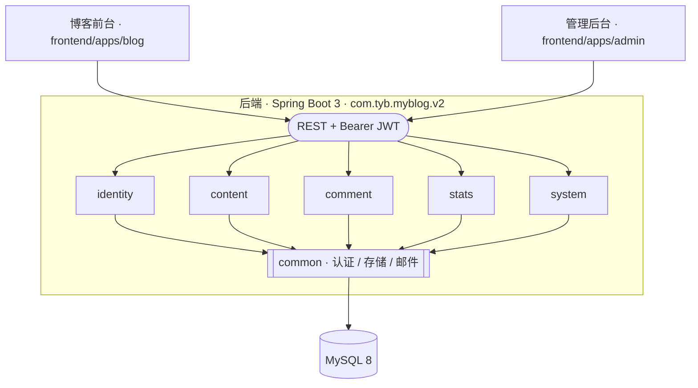
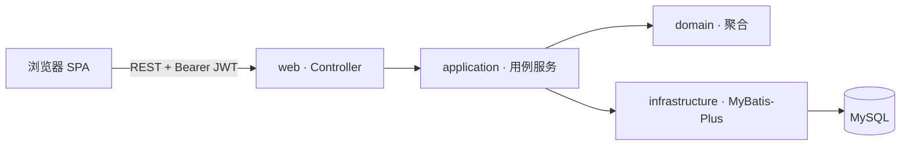

# MyBlog V2

**简体中文** | [English](./README.en.md) | [日本語](./README.ja.md)


一个模块化单体的个人博客系统。后端使用 Spring Boot 3 + Java 17 承载业务，前端拆成公开博客与管理后台两个独立的 Vue 3 应用。V2 是当前唯一维护的主线，已部署到[公开博客](https://tong-yibin.com)与[管理后台](https://admin.tong-yibin.com)；V1 只保留在只读分支 `archive/v1-master-2026-06-26`。

<sub>
  <a href="#概览">概览</a> ·
  <a href="#起源">起源</a> ·
  <a href="#架构">架构</a> ·
  <a href="#技术选型">技术选型</a> ·
  <a href="#目录结构">目录结构</a> ·
  <a href="#本地运行">本地运行</a> ·
  <a href="#数据库">数据库</a> ·
  <a href="#测试与验证">测试与验证</a> ·
  <a href="#生产交付">生产交付</a> ·
  <a href="#文档">文档</a> ·
  <a href="#与-v1-的关系">与 V1 的关系</a> ·
  <a href="#license">License</a>
</sub>

## 概览

- **形态**：单一 Spring Boot 后端 + 两个独立部署的前端 SPA。
- **架构风格**：模块化单体（Modular Monolith），业务按限界上下文切分成五个模块，模块之间的依赖方向由 ArchUnit 测试强制约束。
- **契约边界**：模块内部按 `web / application / domain / infrastructure` 四层组织；对外通过 REST + JWT 提供接口，公开端点在配置中显式声明。
- **持久化**：MySQL + MyBatis-Plus，schema 演进由 Flyway 管理。
- **可运行性优先**：无 Redis / RabbitMQ / Elasticsearch / Quartz 等运行时依赖，本机只需 JDK 17、Node 24、MySQL 即可完整跑通。

### 当前能力

- **公开博客**：所有公开页面统一使用 `/zh`、`/ja`、`/en` 语言前缀，覆盖首页、文章、分类、标签、归档、搜索、关于、友链、留言板和评论；PASSWORD 文章通过独立解锁接口换取短期访问令牌。
- **内容编排**：支持草稿、公开、私密、密码和定时状态；首页提供 1 篇置顶、最多 2 篇精选和普通文章列表。
- **管理后台**：覆盖文章、首页槽位、分类标签、评论、友链、附件、站点配置、作者资料、密码修改和统计仪表盘。
- **身份与数据**：ADMIN/DEMO 权限、JWT access token、数据库 refresh token 轮换与撤销；Flyway V1–V6 管理 16 张表，并统一软删除、审计字段和 `Asia/Tokyo` 时间口径。
- **交付运行**：GitHub Actions 对后端、真实 MySQL、Linux PowerShell、博客端和管理端执行 CI；`main` 使用同一提交 SHA 发布 GHCR 镜像并自动部署到 AWS EC2。

## 起源

V2 三端各自的出发点不同，取舍也不同：

- **后端**：灵感来自 [`aurora-springboot`](https://github.com/linhaojun857/Aurora)——一个功能齐备但依赖较重的博客后端（Spring Boot 2 + Spring Security + Redis + RabbitMQ + Elasticsearch + Quartz + AWS S3）。V2 保留了其业务域的划分思路（内容 / 评论 / 用户权限 / 站点系统 / 统计），但代码**从零开发**，剥离所有可选中间件，改用 JWT 自签 + Caffeine 本机缓存 + Flyway 迁移 + 本地/S3 可插拔存储，目标是"单机可跑、模块边界能被测试锁死"。
- **博客前台**：源自 [`auroral-ui/hexo-theme-aurora`](https://github.com/auroral-ui/hexo-theme-aurora)——一个 Vue 3 编写、原本嵌入 Hexo 的博客主题。原工程构建链与 Hexo 静态生成器强绑定，同时携带 gitalk / valine / twikoo / waline 等多套评论插件的 CDN 引入，配置面很宽。V2 将其**从 Hexo 中剥离为独立 SPA**：移除 Hexo 集成层与冗余评论插件、清理 `templates/*` 与 `server.proxy` 相关的 Hexo dev-server 依赖、升级 Vite / TypeScript / 依赖包版本，并将数据源从 `hexo-generator-json` 静态 JSON 切换到自研后端 REST API。
- **管理后台**：以 [`pure-admin-thin`](https://github.com/pure-admin/pure-admin-thin) 为脚手架快照引入，在此基础上裁剪模板、按业务补齐视图与 API 客户端。

## 架构

### 全景



### 后端模块划分

后端根包 `com.tyb.myblog.v2`，共五个业务模块 + 一个公共模块：

| 模块         | 职责                                              |
| ------------ | ------------------------------------------------- |
| `identity`   | 用户、角色、权限、认证、JWT 签发                  |
| `content`    | 文章、分类、标签，含定时发布                      |
| `comment`    | 文章评论与留言板，含关键词审核                    |
| `stats`      | 页面访问统计与聚合任务                            |
| `system`     | 站点配置、友链、上传媒体等运营能力                |
| `common`     | 跨模块基础设施：认证、错误、存储、安全、Web、邮件 |

每个业务模块内部固定分层：

```
<module>/
├─ web            # Controller / DTO / 请求响应契约
├─ application    # 用例编排、事务边界、跨聚合协调
├─ domain         # 领域模型与领域服务
└─ infrastructure # MyBatis-Plus 映射、外部适配器
```

`ArchitectureRulesTest` 用 ArchUnit 强制以下约束：模块间不得越权互相依赖、`domain` 层不允许出现 Spring/MyBatis 等框架符号、`common.auth` 的 token 端口不能被业务模块或 Spring Security 直接引用。任何架构漂移都会在 `mvn test` 阶段失败。

### 请求路径



`application` 层承担 `@Transactional` 边界与跨聚合协调。公开端点（不需要认证）在 `application.yml` 的 `myblog.security.public-endpoints` 中集中声明，其余接口默认要求 JWT。

### 前端拆分

- `frontend/apps/blog`：面向访客的公开博客。技术栈 Vue 3 + Vite + TypeScript + Pinia + Vue Router 4 + vue-i18n + markdown-it，源码按 `pages / components / features / shared / stores` 组织。源自 Hexo 主题 `hexo-theme-aurora`，已剥离 Hexo 运行时（详见“起源”节）。
- `frontend/apps/admin`：面向站长的管理后台。基于 `pure-admin-thin` 模板脚手架，使用 Vue 3 + Vite + TypeScript + Element Plus + Tailwind CSS + Pinia，Vitest 作为单元测试。

两个前端各自独立构建与部署，通过 REST 与同一个后端交互。

## 技术选型

| 层         | 选型                                  | 说明                                                    |
| ---------- | ------------------------------------- | ------------------------------------------------------- |
| 运行时     | Java 17 / Node 24                     | 由 Maven Enforcer、前端 `engines` 与 CI 版本共同约束    |
| 后端框架   | Spring Boot 3.5                       | Servlet + Spring Security + Validation                  |
| 持久化     | MyBatis-Plus 3.5 + MySQL 8            | 手写 SQL 与轻量 ORM 组合                                |
| 迁移       | Flyway                                | `db/migration/V*__*.sql`，启动时自动执行                |
| 认证       | JWT access + 数据库 refresh token     | 支持轮换、退出与改密撤销；PASSWORD 使用短期文章访问令牌 |
| 限流       | Caffeine 本机缓存                     | 登录失败、评论频率/重复提交与访问打点的单实例控制       |
| 邮件       | Resend HTTP API                       | 默认关闭，按需开启                                      |
| 存储       | LOCAL / AWS S3 可插拔                 | 通过 `myblog.storage.type` 切换                         |
| 内容处理   | Commonmark + OWASP HTML Sanitizer     | Markdown 渲染与 XSS 净化                                |
| 映射       | MapStruct + Lombok                    | DTO / 领域 / 持久化对象转换                             |
| 架构测试   | ArchUnit                              | 模块边界与依赖方向                                      |
| API 文档   | Springdoc / Knife4j                   | 默认关闭，本地按需启用                                  |
| 部署       | Docker Compose + Caddy + GHCR         | AWS EC2 单实例，Route 53 域名与 S3 对象存储             |

## 目录结构

```
My-Blog
├─ MyBlog-springboot-v2/           # V2 后端（当前主线）
│  ├─ src/main/java/com/tyb/myblog/v2/
│  ├─ src/main/resources/
│  │  ├─ application.yml           # 基线配置
│  │  ├─ application-local.yml     # 本机 profile
│  │  ├─ db/migration/             # Flyway SQL
│  │  └─ mapper/                   # MyBatis XML
│  ├─ scripts/                     # 本地辅助脚本
│  └─ .env.example                 # 必要环境变量样例
├─ frontend/
│  └─ apps/
│     ├─ blog/                     # V2 公开博客
│     └─ admin/                    # V2 管理后台
├─ deploy/                         # Web 镜像、Caddy 与生产部署资源
├─ docs/                           # 当前手册、治理、产品与展示资料
└─ .github/workflows/              # CI 与同 SHA 镜像发布/部署
```

## 本地运行

### 前置

- JDK 17
- Maven 3.9+
- Node 24，通过 `corepack` 启用 pnpm 9
- MySQL 8，本机建库 `myblog_v2_dev`（Flyway 会负责建表与迁移）

### 环境变量

后端读取以下变量（详见 `MyBlog-springboot-v2/.env.example`）：

<details>
<summary>展开变量清单</summary>

```
MYBLOG_DATASOURCE_USERNAME=root
MYBLOG_DATASOURCE_PASSWORD=<本机 MySQL 密码>
MYBLOG_JWT_SECRET=<至少 32 字符的随机串>
MYBLOG_STATS_HASH_SECRET=<至少 32 字符的随机串>
```

</details>

真实密钥通过本机环境变量或 IDE 运行配置注入，仓库中不保存生产值。

> [!IMPORTANT]
> 生产环境的 `MYBLOG_JWT_SECRET` 与 `MYBLOG_STATS_HASH_SECRET` 必须替换为高熵随机串。示例值仅供本机开发使用，泄露即等同于伪造任意用户会话。

### 启动三端

```powershell
# 后端
cd MyBlog-springboot-v2
mvn spring-boot:run -Dspring-boot.run.profiles=local


# 博客前台
cd frontend/apps/blog
corepack pnpm install --frozen-lockfile
corepack pnpm dev


# 管理后台
cd frontend/apps/admin
corepack pnpm install --frozen-lockfile
corepack pnpm dev
```

默认监听地址：


## 数据库

- 迁移脚本位于 `MyBlog-springboot-v2/src/main/resources/db/migration/`，当前为 V1–V6、16 张表，命名遵循 Flyway 规范（`V<version>__<description>.sql`）。
- 后端启动时自动执行未应用的迁移，无需手动导入 SQL。
- 时区固定为 `Asia/Tokyo`，MySQL 连接串与 Jackson 序列化均对齐这一时区。

> [!WARNING]
> 时区是强约束。部署主机、MySQL server 时区与应用配置任何一处偏离 `Asia/Tokyo`，都会让文章发布时间、评论时间戳与统计聚合出现难以察觉的偏移。

## 测试与验证

| 命令                                                                             | 覆盖范围                              |
| -------------------------------------------------------------------------------- | ------------------------------------- |
| `mvn clean test`                                                                 | 后端单元/集成测试与 ArchUnit 架构约束 |
| `pwsh -File MyBlog-springboot-v2/scripts/dev/mysql/initialize.contract-test.ps1` | 本地 MySQL 初始化脚本安全契约         |
| `corepack pnpm --dir frontend/apps/blog test`                                    | 博客端 Vitest                         |
| `corepack pnpm --dir frontend/apps/blog typecheck`                               | 博客端 TypeScript + Vue TSC           |
| `corepack pnpm --dir frontend/apps/blog build`                                   | 博客端生产构建与 chunk 预算           |
| `corepack pnpm --dir frontend/apps/admin test`                                   | 管理端 Vitest                         |
| `corepack pnpm --dir frontend/apps/admin typecheck`                              | 管理端 TypeScript + Vue TSC           |
| `corepack pnpm --dir frontend/apps/admin build`                                  | 管理端生产构建                        |

任何触碰模块划分或跨模块依赖的改动，都应以后端测试中的 ArchUnit 结果作为门禁。真实 MySQL 8.4 方言、迁移和并发行为由 CI 的独立 Testcontainers job 验证。

## 生产交付

`main` 的发布工作流分别构建 API 与 Web 镜像，只使用完整提交 SHA 作为 GHCR 标签。生产部署通过 GitHub OIDC 获取临时 AWS 权限，仅在部署期间开放 Runner 的 SSH `/32`，远端以同一 SHA 更新 Docker Compose；完成后检查 API Actuator 以及博客、`www`、管理端三条 HTTPS `/healthz` 的固定正文 `ok`，并始终撤销临时入站规则。

生产结构、环境变量、首次部署、日常发布、故障恢复和回滚以 [`docs/handbook/ops/`](docs/handbook/ops/README.md) 为准。仓库不记录真实 IP、资源 ID、密码、密钥或完整生产环境变量。

## 文档

- [文档入口](docs/README.md)
- [当前状态](docs/handbook/start-here/current-status.md)
- [开放问题](docs/handbook/start-here/open-issues.md)
- [API 契约](docs/handbook/api/README.md)
- [业务规格](docs/handbook/product/README.md)
- [运行、验证与发布](docs/handbook/ops/README.md)

## 与 V1 的关系

> [!NOTE]
> 当前主线不再包含 V1 目录或兼容层。需要对照旧实现和数据结构时，只读查看 `archive/v1-master-2026-06-26` 分支。

- V1 本身是对 [`aurora-springboot`](https://github.com/linhaojun857/Aurora) / [`aurora-blog`](https://github.com/auroral-ui/hexo-theme-aurora) 一系列上游工程的改造版本，运行时依赖 Spring Security / Redis / RabbitMQ / Elasticsearch / Quartz / AWS S3，属于"功能齐但重"的形态。
- V2 不复用 V1 的运行时依赖，也不复用其数据库 schema；两套 schema 相互独立，需要迁移数据时以 SQL 脚本方式一次性完成，而非在运行期共存。

## License

本仓库以 [MIT](./LICENSE) 授权。

- `frontend/apps/blog` 派生自 [`auroral-ui/hexo-theme-aurora`](https://github.com/auroral-ui/hexo-theme-aurora)（MIT），保留其原始 [`LICENSE`](./frontend/apps/blog/LICENSE) 与版权声明。
- `frontend/apps/admin` 基于 [`pure-admin/pure-admin-thin`](https://github.com/pure-admin/pure-admin-thin)（MIT）脚手架，保留其原始 [`LICENSE`](./frontend/apps/admin/LICENSE) 与版权声明。
- 后端仅在业务域划分上参考 [`linhaojun857/Aurora`](https://github.com/linhaojun857/Aurora)（Apache-2.0），代码由本仓库从零编写。
