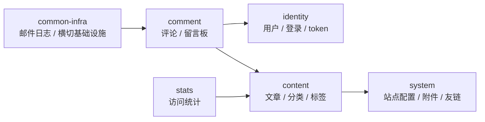
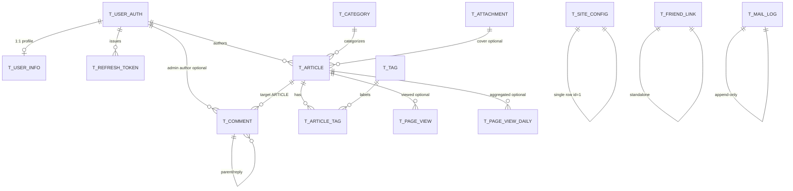

# V2 ER / 领域关系图

> 本文档回答："V2 的核心实体之间是什么关系？"
> 范围：用于 DDL 冻结前评审领域关系；物理字段和索引以 `arch/schema-design.md` 为准。

## 1. 模块级关系

## 2. 表关系图

说明：

- 图中关系是**逻辑引用**，不是 DB FOREIGN KEY；DDL 禁止 `FOREIGN KEY`。
- `t_comment.target_type + target_id` 同时承载文章评论和留言板。ARTICLE 时逻辑指向 `t_article.id`，GUESTBOOK 时 `target_id=0`。
- `t_article_tag` 是纯关联表，不带审计列。
- `t_site_config` 是单行宽表，固定 `id=1`。
- `t_page_view`、`t_page_view_daily`、`t_mail_log` 是审计列例外表。

## 3. DDL 冻结前检查点

- identity：`t_user_auth / t_user_info / t_refresh_token` 能表达 ADMIN / DEMO / GUEST 与双 token。
- content：`t_article / t_category / t_tag / t_article_tag` 能表达三语标题摘要、分类标签、slug、5 态文章状态。
- comment：`t_comment` 能表达文章评论、留言板、两层回复、审核状态和安全 HTML。
- system：`t_site_config / t_attachment / t_friend_link` 能表达站点宽表、附件去重和友链显示/隐藏。
- stats：`t_page_view / t_page_view_daily` 能表达原始打点和日聚合。
- common-infra：`t_mail_log` 只记录邮件失败日志。
