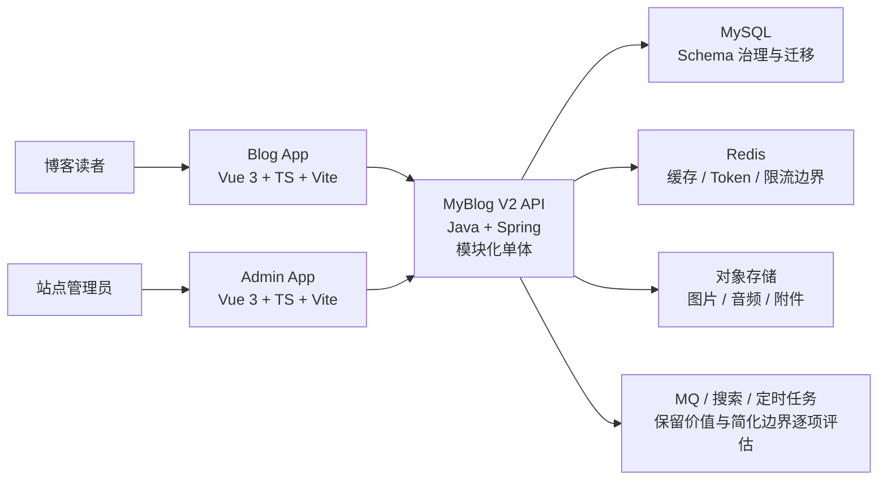

# MyBlog V2 全量重构设计

## 1. 文档定位

这份文档定义我对 MyBlog V2 的全量重构设计。它不是一次漏洞修复清单，也不是只谈目标架构的空路线图。它要同时回答四个问题：

1. 我为什么要重构当前 MyBlog。
2. 我准备把 V2 重构到什么边界。
3. 前台、后台、Java 后端和数据库应该怎样协同重构。
4. 我如何判断这次重构在阶段内真正完成。

现有线上版本在 V2 建设期间继续承担稳定运行职责。V2 在原仓库的独立重构分支内推进，允许我对前端工程、后端模块、API 契约、数据库结构和必要运行边界做结构性调整。

## 2. 总体目标

### 2.1 保留现有业务能力

我不会把现有业务能力当成可以随意丢弃的历史包袱。V2 至少要覆盖当前 MyBlog 已经具备的核心能力：

- 博客前台展示、文章详情、分类、标签、归档和搜索。
- 评论、回复、订阅、友链、说说、相册和音乐能力。
- 后台内容管理、站点配置、用户、角色、菜单和资源权限管理。
- 上传、通知、日志、定时任务和现有必要的基础设施协作。

### 2.2 建立统一 V2 工程基线

我希望 V2 不再只是旧结构上的功能堆叠，而是形成下一阶段可持续迭代的工程基线：

- 前台和后台仍是两个独立应用，但进入同一前端 workspace。
- 两个前端应用统一使用 Vue 3、TypeScript、Composition API、`<script setup>` 和 Vite。
- Java 后端继续使用 Java + Spring 技术路线，但重构为模块化单体，并升级到更合适的稳定技术基线。
- 数据库保留数据资产和核心业务概念，同时建立结构治理、迁移、校验和回滚约束。
- 部署交付本期不作为主执行线，但代码、配置、日志、迁移和健康边界不能为后续上线治理埋雷。

### 2.3 解决会持续制造技术债的问题

我希望本次重构解决的不是表面不整齐，而是那些会反复制造维护成本的问题：

- 前后台工程基线不统一。
- 前端接口处理、类型、页面职责和共享边界不够清楚。
- 后端安全边界、模块边界和基础设施边界偏弱。
- 不优雅实现、重复逻辑、魔法值、职责过重实现类和注释不足影响代码表达。
- 自动化测试、静态检查、数据迁移校验和质量门禁不足。

## 3. 非目标与边界

### 3.1 本次不做什么

- 本次重构不是立即替换线上版本。
- 本次重构不是微服务化，当前体量不值得承担服务拆分、分布式事务和服务治理复杂度。
- 本次重构不是无约束重写，所有结构性调整都要能说明收益、迁移路径和验收依据。
- 本次重构不是为了追逐版本数字。技术升级以官方推荐、稳定性、维护性和生态成熟度为依据。
- 本次重构不默认抛弃现有数据资产。数据库可以结构性调整，但必须有迁移、校验和回滚策略。
- 本次重构不把视觉改版或产品功能扩张设为总主线。必要体验治理放在前台和后台专项中处理。

### 3.2 本期范围

本期主范围包括：

- 前端 workspace 与博客前台 V2。
- 后台管理端 V2。
- Java 后端 V2。
- 数据库 V2 治理与迁移策略。

部署本期只保留必要约束：

- 配置和密钥边界清楚。
- 数据库迁移具备版本化入口。
- 日志、安全、健康检查和依赖失败边界不埋雷。
- 构建与运行方式不被业务代码写死。

服务器配置、反向代理、CI/CD 发布链路、备份恢复、灰度切换、线上回滚和容器化是否引入，后续单开交付专项。

## 4. 现有系统问题分类

### 4.1 工程基线不统一

我发现 MyBlog 当前三端虽然已经具备完整业务能力，但工程基线并不统一。博客前台已经进入 Vue 3 体系，后台仍停留在 Vue 2、Vuex 与 Element UI 体系，Java 后端仍依赖较旧的 Spring Boot 和部分历史依赖。这个问题短期不会让项目马上失效，但会持续放大开发、升级、协作和排查成本。因此，我会在 V2 中统一前端工程基线，升级后端技术基线，并为数据库、配置、测试和规范建立明确规则。

### 4.2 架构边界不清

我发现当前项目更像是在功能增长过程中逐步堆叠出来的工程。前端存在页面逻辑、状态逻辑和接口处理交织的问题，后端则主要依赖横向分层组织代码，业务域边界、基础设施边界和公共能力边界都不够清楚。这个问题会让代码影响范围越来越难判断，也会让所谓公共工具继续膨胀成新的耦合点。因此，我会让前端按应用边界和共享边界组织，让后端按模块化单体和业务域边界组织。

### 4.3 安全与输入边界薄弱

我在审计中发现，当前后端在鉴权、CORS、CSRF、JWT、上传、日志脱敏、输入校验和部分用户操作边界上存在明显薄弱点。它们不是孤立的小问题，而是在系统默认边界不够严格时叠加出来的风险。如果我只在某个接口上补丁式修复，而不重建统一安全基线，同类问题还会在后续功能中反复出现。因此，V2 必须把安全能力从零散修补提升为系统默认约束。

### 4.4 代码质量与表达质量不足

我发现当前代码中仍存在不少只为实现功能而留下的粗糙写法：重复逻辑、职责过重的实现类、魔法值、弱约束的数据传递、风格不一致的命名和缺少解释关键决策的注释。这些问题不一定马上表现为 bug，但会直接降低我理解代码、修改代码和验证代码的效率。因此，这次重构不能只追求功能不坏，还必须把代码表达质量纳入验收标准。

### 4.5 测试与质量门禁不足

我发现当前项目缺少足够的自动化测试和质量门禁，很多重构判断只能依赖手工回归和个人记忆。对于一次覆盖前台、后台、后端和数据库的 V2 重构来说，这种状态本身就是风险。因此，我会把测试、静态检查、类型检查和关键回归用例作为重构基础设施，而不是放到最后补作业。

### 4.6 数据治理缺位

我发现当前项目已经有稳定业务数据和初始化 SQL，但数据库结构演进、迁移版本、约束策略和数据校验并没有成为工程基线的一部分。只改应用代码、不治理数据结构，会让 V2 继续被旧表设计和手工迁移方式束缚。因此，我会在保留现有业务数据的前提下，对数据库结构、迁移脚本、索引约束和回滚校验做系统整理。

### 4.7 性能、稳定性与运行边界缺少基线

我发现当前项目更关注功能是否可用，但对性能、稳定性和运行边界缺少成体系的基线。文章列表、评论、后台查询、缓存、搜索、上传、异步通知和定时任务等能力一旦在 V2 中重构，如果我只关注代码结构而不明确查询边界、缓存策略、依赖失败行为和关键链路验收标准，就可能把问题从代码难维护转移成运行时难判断。因此，我会为关键链路补充性能和稳定性约束，但不会在没有证据的前提下做过度优化。

## 5. 目标架构

### 5.1 应用架构



### 5.2 前端工作区

前端 V2 保留博客前台和后台管理端两个产品边界，但用一个 workspace 管理共同工程基线：

```text
frontend
├─ apps
│  ├─ blog
│  └─ admin
├─ packages
│  ├─ api-client
│  ├─ types
│  ├─ utils
│  ├─ config
│  └─ ui
```

`ui` 只承接真实、稳定、长期共享的组件，不为共享而强行抽取前后台业务组件。

### 5.3 后端模块化单体

后端 V2 仍是一个主服务，但内部边界要从纯横向堆叠收敛为模块化单体：

```text
myblog-v2
├─ bootstrap
├─ common
│  ├─ web
│  ├─ security
│  ├─ exception
│  ├─ validation
│  ├─ observability
│  └─ support
├─ modules
│  ├─ identity
│  ├─ content
│  ├─ interaction
│  ├─ media
│  ├─ site
│  ├─ notification
│  ├─ search
│  └─ operations
└─ infrastructure
   ├─ persistence
   ├─ cache
   ├─ mq
   ├─ storage
   ├─ search
   └─ scheduler
```

媒体、搜索、通知和任务等能力可以保留未来演进边界，但本期不拆成微服务。

## 6. 专项路线

### 6.1 Java 后端 V2

Java 后端是 V2 第一条实际落地主线。我会先在后端建立新的安全边界、API 契约、模块组织、配置规范、测试基线和数据库协作方式，再让前台和后台围绕更稳定的接口边界迁移。

#### 后端目标

- 保留当前核心业务能力。
- 建立模块化单体边界。
- 重建安全默认值。
- 统一响应、错误码、分页、鉴权失败和上传行为。
- 升级 Java + Spring 技术基线，重点评估 Spring Boot、Spring Security、JWT 和 JSON 依赖。
- 提升命名、职责、注释和测试质量。
- 建立单元测试、集成测试和安全回归基线。

#### 后端问题与重构方向

| 我发现的问题          | 会导致什么                  | 我准备怎样重构          |
| --------------- | ---------------------- | ---------------- |
| 安全边界依赖零散配置和历史实现 | 鉴权、上传、日志和校验风险持续出现      | 建立默认安全策略和统一基础能力  |
| 后端主要按横向分层堆叠     | 业务边界不清，服务类和工具类膨胀       | 按模块化单体重组业务边界     |
| 依赖版本偏旧          | 升级成本累积，安全修复和生态支持受限     | 制定稳定升级路径并验证关键依赖  |
| API 契约不够系统化     | 前后台各自适配，错误和分页处理分散      | 统一响应、错误码、分页和鉴权行为 |
| 基础设施依赖与业务逻辑耦合   | Redis、MQ、搜索和存储变化影响业务代码 | 抽清接口边界和失败策略      |
| 代码表达质量不稳定       | 读懂和修改成本高               | 统一命名、职责、注释和测试要求  |
| 自动化测试不足         | 不敢改、不敢升级               | 关键链路先补分层测试       |

#### 后端执行优先级

1. 立工程、技术、API、安全、测试和数据库协作基线。
2. 先重构认证授权、JWT、上传、日志脱敏、异常、输入校验、XSS 与限流边界。
3. 按 `identity`、`content`、`media`、`interaction`、`site`、`notification`、`search`、`operations` 顺序迁移业务域。
4. 做三端联调、安全回归、数据迁移验证和质量收口。

### 6.2 前端 workspace 与博客前台 V2

博客前台 V2 的目标不是展示技术，而是让内容阅读、浏览、互动和多媒体体验在更清晰的工程结构下持续演进。

我会重点处理：

- 从现有前台基线迁移到 Vite。
- 页面与组件统一 Vue 3 `<script setup>` 和 TypeScript 边界。
- 接入共享 API client、共享类型和共享配置。
- 治理文章、评论、分页、搜索、Markdown、多语言和主题相关高频逻辑。
- 迁移首页、文章链路、评论互动、分类标签、归档搜索、相册、说说、音乐和友链等现有能力。

### 6.3 后台管理端 V2

后台管理端 V2 不是把旧 Vue 2 页面逐页翻译，而是在保留管理能力的前提下重建一套 Vue 3 管理端工程。

我会重点处理：

- 从 Vue 2、Vuex、Vue Router 3 和 Element UI 迁移到 Vue 3 V2 基线。
- 建立登录、后台布局、权限路由和管理端状态边界。
- 迁移文章、评论、用户权限、站点配置、媒体、日志和任务等核心模块。
- 盘点并治理编辑器、图表、上传、表格、表单和权限相关依赖。
- 抽取表格查询、表单提交、分页、弹窗确认、上传和错误反馈等高频管理能力。

### 6.4 数据库 V2

数据库 V2 允许结构性治理，但不允许把改代码方便当成破坏数据资产的理由。

我会重点处理：

- 盘点现有 schema、初始化 SQL 和核心数据关系。
- 按后端模块映射数据库表归属。
- 评估表名、字段、索引、唯一约束、状态表达、冗余关系和查询边界。
- 建立初始化结构、增量迁移、历史数据迁移、校验和回滚要求。
- 让表结构调整服务于业务模型、数据正确性和迁移可行性，而不是只追求命名整齐。

### 6.5 部署交付约束

部署本期不作为主执行线。我会保留以下约束：

- 数据库、Redis、对象存储、邮件、JWT、搜索等配置和密钥边界清楚。
- 数据库变更具备版本化迁移入口。
- 后端保留健康检查、日志脱敏、错误分级和必要依赖失败策略。
- 前后端都能通过明确、可重复的构建命令产出可验证产物。

## 7. 分阶段路线

| 阶段   | 目标            | 主要产物                           |
| ---- | ------------- | ------------------------------ |
| 阶段 0 | 重构准备与基线确认     | 总计划、专项计划、业务能力清单、风险与迁移清单        |
| 阶段 1 | V2 工程骨架建设     | 前端 workspace、后端骨架、数据库迁移基线、工程规范 |
| 阶段 2 | 后端安全与公共能力先行   | 身份安全、上传安全、日志异常、校验分页和安全回归基线     |
| 阶段 3 | 后端业务域与数据库协同迁移 | V2 后端模块、数据库迁移脚本、API 契约和模块测试    |
| 阶段 4 | 博客前台 V2 迁移    | 博客前台 V2 与关键读者路径回归              |
| 阶段 5 | 后台管理端 V2 迁移   | 后台管理端 V2 与关键管理操作回归             |
| 阶段 6 | 三端联调与替换准备     | 联调报告、迁移验证、风险清单和后续交付专项入口        |

### 7.1 里程碑

| 里程碑 | 标志                |
| --- | ----------------- |
| M0  | V2 计划和边界确认        |
| M1  | 三端骨架与数据库迁移基线建立    |
| M2  | 后端安全与公共能力基线建立     |
| M3  | 核心后端业务域迁移完成       |
| M4  | 博客前台 V2 核心能力迁移完成  |
| M5  | 后台管理端 V2 核心能力迁移完成 |
| M6  | 三端联调与替换准备完成       |

## 8. 风险与取舍

| 风险         | 具体表现               | 控制方式                |
| ---------- | ------------------ | ------------------- |
| 范围膨胀       | 三端重构扩张成无限功能重做      | 写清本期目标、非目标和阶段产物     |
| 业务遗漏       | 重构时只迁自己记得的功能       | 建立业务能力清单和迁移对照表      |
| 升级与业务迁移混乱  | 依赖升级问题和业务 bug 混在一起 | 先立工程基线，再迁业务域        |
| API 契约反复变化 | 前后台多次跟着后端改         | 先定 API 规范，按模块稳定后迁页面 |
| 数据迁移风险     | 改表后旧数据无法准确进入 V2    | 迁移脚本、校验脚本、备份和回滚要求   |
| 过度设计       | 为未来假设引入太多抽象        | 保持模块化单体，不提前微服务化     |
| V2 分支长期漂移  | V2 和线上旧版差异越来越大     | 以阶段里程碑和差异记录控制       |
| 测试不足       | 关键链路退化而不自知         | 自动化测试和人工回归清单并行      |

## 9. 验收标准

### 9.1 业务验收

- 现有核心业务能力有迁移对照。
- 前台、后台和后端关键路径可用。
- 保留、重构、替代或废弃的能力有明确记录。

### 9.2 架构验收

- 前端两个应用边界清楚，共享层不混乱。
- 后端业务模块边界清楚，基础设施依赖不乱穿。
- 数据结构与模块关系可解释。

### 9.3 安全验收

- 鉴权、上传、日志、输入校验、Token、XSS 和限流有统一策略。
- 关键风险场景有回归验证。
- 新代码不依赖开发者临时记忆来维持安全默认值。

### 9.4 代码质量验收

- 命名、目录、注释、异常、日志和测试规则有明确基线。
- 明显重复、魔法值和职责混乱实现被重点治理。
- 新代码不继续复制旧式问题。

### 9.5 数据与稳定性验收

- 数据库变更可迁移，核心历史数据可校验，回滚路径清楚。
- 索引、约束、缓存、上传、外部依赖失败和定时任务边界有依据。
- 系统运行问题比旧版更容易判断和定位。

## 10. 可拆分任务框架

### 10.1 V2 基线任务

- [ ] 确认 V2 分支策略。
- [ ] 建立业务能力清单和旧系统问题清单。
- [ ] 确认前端 workspace、后端模块和数据库迁移原则。
- [ ] 确认 API 契约、代码、注释、测试和质量门禁规范。

### 10.2 后端任务

- [ ] 制定 Java / Spring 技术升级基线。
- [ ] 建立模块化单体骨架。
- [ ] 建立统一异常、响应、分页和校验。
- [ ] 建立安全默认策略。
- [ ] 重构认证授权、上传、日志脱敏、XSS 和限流边界。
- [ ] 按业务域迁移模块并建立测试与静态检查。

### 10.3 前端任务

- [ ] 建立 workspace、`blog` V2 和 `admin` V2。
- [ ] 建立共享 API client、types、utils 和 config。
- [ ] 建立前端类型检查、Lint、测试和环境变量规则。
- [ ] 迁移博客前台核心读者路径。
- [ ] 迁移后台核心管理路径和权限体系。

### 10.4 数据库任务

- [ ] 盘点现有 schema 和数据关系。
- [ ] 建立 V2 迁移脚本规则。
- [ ] 评估索引、约束、字段和表结构治理。
- [ ] 按业务域落地结构调整、迁移校验和回滚要求。

### 10.5 联调与收口任务

- [ ] 建立三端业务能力迁移对照表。
- [ ] 做 API、安全、关键页面和关键接口回归。
- [ ] 做数据迁移演练。
- [ ] 整理后续部署与上线专项计划。

## 11. 后续专项文档

总设计确认后，后续至少拆出这些专项文档：

1. Java 后端 V2 重构专项计划。
2. 前端 workspace 与博客前台 V2 重构专项计划。
3. 后台管理端 V2 迁移专项计划。
4. 数据库 V2 治理与迁移专项计划。
5. MyBlog V2 交付、部署与上线专项计划。

当前最先细化的是 Java 后端 V2 重构专项计划，因为它是第一条落地主线。
