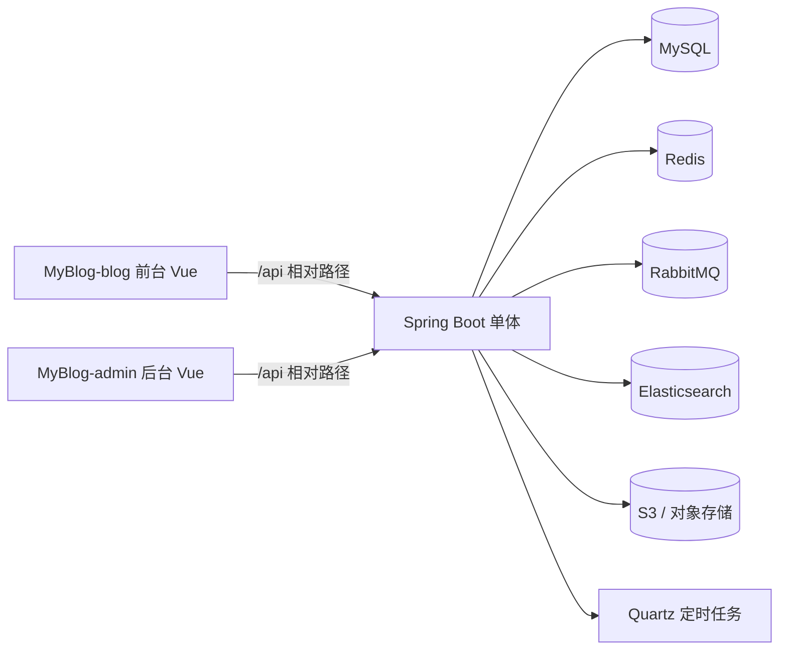
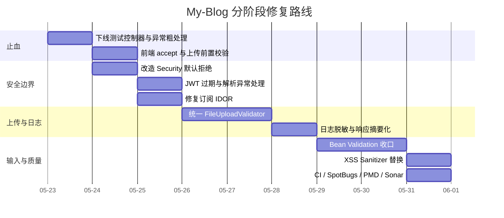

# My-Blog 仓库全量代码审计与重构计划

## 执行摘要

我对 `tongchang01/My-Blog` 进行了以仓库代码为主、以官方安全与框架文档为辅的审计。高置信度结论很直接：这个项目**能跑，但安全边界是松的，输入验证是碎的，上传链路是裸的，日志是过度的，鉴权模型是危险地“依赖数据库配置正确”**。最严重的问题不是某一个单点 bug，而是几个问题叠加后形成的系统性脆弱：`Spring Security` 里使用了 `anyRequest().permitAll()`，再配合“数据库资源表动态匹配 URL 决定是否鉴权”的模型，意味着**只要某个后台 URL 没有被正确录入资源表，就可能直接公开放行**；同时项目全局禁用了 CSRF、MVC 层配置了 `allowedOrigins("*") + allowCredentials(true)` 的 CORS 组合、JWT 只依赖 Redis 过期而 token 本身没有 `exp` claim，且解析异常没有在过滤器里做兜底；文件上传链路直接把 `MultipartFile` 交给上传策略，没有做扩展名白名单、MIME、文件签名、大小、文件名安全校验；操作日志与异常日志把请求参数、响应体、异常堆栈大量落库，明显有记录密码、验证码、token、个人信息的风险。fileciteturn125file0 fileciteturn126file0 fileciteturn127file0 fileciteturn129file0 fileciteturn130file0 fileciteturn59file0 fileciteturn61file0 fileciteturn101file0 fileciteturn102file0

更具体地说，仓库当前最值得立即动刀的地方有六个。第一，**后台接口保护策略必须改成“默认拒绝”**，不能再把“是否受保护”寄托在数据库资源映射完整无误上。第二，**上传链路必须建立统一校验器**，并在照片、音乐、头像、配置图片、文章图片、文章导入接口全部复用。第三，**日志脱敏必须立即做**，至少把密码、验证码、token、Authorization、响应 token、邮箱验证码等字段剔除。第四，**`/users/subscribe` 存在典型水平越权设计**，因为客户端可以提交 `userId` 直接控制任意用户订阅状态。第五，**验证码与登录限流不足**，当前只对 `/users/code` 和 `/comments/save` 做了基于 `IP + 方法名` 的简单限流，登录、注册、改密码都不够。第六，**前端代理和上传组件没有形成环境化配置与前置校验闭环**：两个 `vue.config.js` 都硬编码到 `localhost:8080`，博客端 API 使用相对 `/api` 是对的，但代理切换逻辑仍然脆弱；上传组件没有 `accept`，也没有前端类型拦截；音乐播放器的 `listMaxHeight` 已经设置为 `132px`，方向是对的，但仍然是硬编码魔数，应该转成可解释、可复用的 4 行列表高度配置。fileciteturn115file0 fileciteturn128file0 fileciteturn114file0 fileciteturn67file0 fileciteturn68file0 fileciteturn98file0 fileciteturn72file0 fileciteturn73file0 fileciteturn69file0

外部最佳实践也支持上述结论。Spring Security 官方文档明确说明 CORS 必须先于 Security 处理，且建议通过 `CorsFilter` 或显式 `CorsConfigurationSource` 集成；Spring Security 对 unsafe HTTP method 默认开启 CSRF 保护；OWASP 文件上传清单明确要求做扩展名白名单、不要信任 `Content-Type`、做文件签名校验、限制文件大小、改写文件名、把文件放在 webroot 之外或至少独立存储，并保护上传免受 CSRF；OWASP XSS 指南明确指出，输出编码和 HTML Sanitization 比“自己手写正则过滤 HTML”更可靠；OWASP Logging 指南明确建议不要把 session 标识、access token、认证密码等直接写入日志。citeturn5view0turn5view1turn6view0turn4view0turn5view3turn5view4turn16view1turn16view2turn16view3

## 审计范围与服务清单

本仓库公开可见部分包含一个 Spring Boot 后端模块 `MyBlog-springboot`，以及两个 Vue 前端模块 `MyBlog-vue/MyBlog-blog` 与 `MyBlog-vue/MyBlog-admin`。后端 `pom.xml` 显示它依赖 `Spring Boot 2.3.7.RELEASE`、`Spring Security`、`MyBatis-Plus`、`Redis`、`RabbitMQ`、`Elasticsearch`、`Quartz`、`AWS S3`、`JJWT 0.9.0`、`Fastjson 1.2.76` 等，说明这是一个标准的“单体应用 + 多基础设施依赖”架构。`README.zh-CN.md` 也明确写了这是博客前台 + 后台管理系统的组合。fileciteturn66file0 fileciteturn2file0



上图中的 MySQL、Redis、RabbitMQ、Elasticsearch、Quartz、S3 是从代码依赖与具体实现中直接可见的；但**部署拓扑、Nginx、CI、实际数据库 schema 初始化 SQL、资源权限表初始数据、生产环境配置文件**没有在公开仓库里完整给出，所以这部分必须视为 **unspecified**。fileciteturn66file0 fileciteturn57file0 fileciteturn62file0 fileciteturn63file0

后端从控制器注入关系可以识别出以下核心业务服务与基础设施服务。这里不玩虚的，列你真正要重构的对象：

| 服务/上下文                       | 主要实现位置                                                                                           | 主要入口                     |
| ---------------------------- | ------------------------------------------------------------------------------------------------ | ------------------------ |
| ArticleService               | `MyBlog-springboot/src/main/java/com/aurora/service/impl/ArticleServiceImpl.java`                | `ArticleController`      |
| CommentService               | `.../service/impl/CommentServiceImpl.java`                                                       | `CommentController`      |
| CategoryService              | 由 `CategoryController` 注入                                                                        | `CategoryController`     |
| FriendLinkService            | 由 `FriendLinkController` 注入                                                                      | `FriendLinkController`   |
| MenuService                  | 由 `MenuController` 注入                                                                            | `MenuController`         |
| PhotoService                 | 由 `PhotoController` 注入                                                                           | `PhotoController`        |
| PhotoAlbumService            | 由 `PhotoAlbumController` 注入                                                                      | `PhotoAlbumController`   |
| TagService                   | 由 `TagController` 注入                                                                             | `TagController`          |
| TalkService                  | 由 `TalkController` 注入                                                                            | `TalkController`         |
| MusicService                 | 由 `MusicController` 注入；实现类可见于搜索结果                                                                | `MusicController`        |
| UserAuthService              | `.../service/impl/UserAuthServiceImpl.java`                                                      | `UserAuthController`     |
| UserInfoService              | `.../service/impl/UserInfoServiceImpl.java`                                                      | `UserInfoController`     |
| AuroraInfoService            | 由 `AuroraInfoController` 注入                                                                      | `AuroraInfoController`   |
| RoleService                  | `RoleController` 注入                                                                              | `RoleController`         |
| ResourceService              | `ResourceController` 注入                                                                          | `ResourceController`     |
| JobService                   | `JobController` 注入                                                                               | `JobController`          |
| JobLogService                | `JobLogController` 注入                                                                            | `JobLogController`       |
| ExceptionLogService          | `ExceptionLogController` 注入                                                                      | `ExceptionLogController` |
| OperationLogService          | `OperationLogController` 注入                                                                      | `OperationLogController` |
| TokenService                 | `.../service/impl/TokenServiceImpl.java`                                                         | 登录、JWT 过滤器               |
| RedisService                 | 多服务共享                                                                                            | 限流、JWT、访问控制等             |
| UploadStrategyContext        | `.../strategy/context/UploadStrategyContext.java`                                                | 所有上传接口                   |
| ArticleImportStrategyContext | `.../strategy/context/ArticleImportStrategyContext.java`                                         | 文章导入                     |
| SearchStrategyContext        | `ArticleServiceImpl` 注入                                                                          | 文章搜索                     |
| Security 资源匹配                | `WebSecurityConfig` + `FilterInvocationSecurityMetadataSourceImpl` + `AccessDecisionManagerImpl` | 全部请求                     |
| 日志切面                         | `OperationLogAspect`、`ExceptionLogAspect`                                                        | 全部 controller/OptLog 方法  |

以上服务与上下文的存在可以从控制器注入、实现类源码、以及安全/切面类源码直接确认。fileciteturn105file0 fileciteturn106file0 fileciteturn107file0 fileciteturn108file0 fileciteturn109file0 fileciteturn110file0 fileciteturn111file0 fileciteturn112file0 fileciteturn113file0 fileciteturn123file0 fileciteturn85file0 fileciteturn86file0 fileciteturn116file0 fileciteturn117file0 fileciteturn118file0 fileciteturn119file0 fileciteturn120file0 fileciteturn121file0 fileciteturn122file0 fileciteturn129file0 fileciteturn57file0 fileciteturn75file0 fileciteturn125file0 fileciteturn126file0 fileciteturn101file0 fileciteturn102file0

## 接口清单

先把丑话说前面：**鉴权列里的“后台预期鉴权”只是业务预期，不是部署事实**。因为仓库里安全模型是 `anyRequest().permitAll()`，真正的授权取决于 `resource_role` 之类的数据库资源映射；仓库没有公开这些数据，所以**任何后台 URL 如果没被资源表正确录入，就有被放行的风险**。因此，下表中所有接口都默认要额外承受全局问题 `I1`、`I2`、`I3`：  
`I1` 默认放行式鉴权模型；`I2` CORS 配置错误；`I3` 全局禁用 CSRF。fileciteturn125file0 fileciteturn126file0 fileciteturn127file0 citeturn5view0turn6view0

### 公共接口与用户接口

| 源码路径 / Controller                                                                  | HTTP | URL                             | 请求参数                   | 响应                              | 鉴权            | 上传  | 端点特有问题ID        |
| ---------------------------------------------------------------------------------- | ---- | -------------------------------:| ---------------------- | ------------------------------- | ------------- | --- | --------------- |
| `.../ArticleController.java` / ArticleController fileciteturn105file0           | GET  | `/articles/topAndFeatured`      | 无                      | `TopAndFeaturedArticlesDTO`     | 公开            | 否   | -               |
|                                                                                    | GET  | `/articles/all`                 | 分页由拦截器注入               | `PageResultDTO<ArticleCardDTO>` | 公开            | 否   | -               |
|                                                                                    | GET  | `/articles/categoryId`          | `categoryId`           | `PageResultDTO<ArticleCardDTO>` | 公开            | 否   | `I12`           |
|                                                                                    | GET  | `/articles/{articleId}`         | `articleId`            | `ArticleDTO`                    | 公开/口令文章会走访问校验 | 否   | `I4`            |
|                                                                                    | POST | `/articles/access`              | `ArticlePasswordVO`    | `ResultVO<?>`                   | 应登录           | 否   | `I4`,`I11`      |
|                                                                                    | GET  | `/articles/tagId`               | `tagId`                | `PageResultDTO<ArticleCardDTO>` | 公开            | 否   | `I12`           |
|                                                                                    | GET  | `/archives/all`                 | 分页                     | `PageResultDTO<ArchiveDTO>`     | 公开            | 否   | -               |
|                                                                                    | GET  | `/articles/search`              | `ConditionVO.keywords` | `List<ArticleSearchDTO>`        | 公开            | 否   | `I12`           |
| `.../CommentController.java` / CommentController fileciteturn106file0           | POST | `/comments/save`                | `CommentVO`            | `ResultVO<?>`                   | 应登录           | 否   | `I10`,`I11`     |
|                                                                                    | GET  | `/comments`                     | `CommentVO` 查询参数       | `PageResultDTO<CommentDTO>`     | 公开            | 否   | `I12`           |
|                                                                                    | GET  | `/comments/{commentId}/replies` | `commentId`            | `List<ReplyDTO>`                | 公开            | 否   | `I12`           |
|                                                                                    | GET  | `/comments/topSix`              | 无                      | `List<CommentDTO>`              | 公开            | 否   | -               |
| `.../CategoryController.java` / CategoryController fileciteturn107file0         | GET  | `/categories/all`               | 无                      | `List<CategoryDTO>`             | 公开            | 否   | -               |
| `.../FriendLinkController.java` / FriendLinkController fileciteturn108file0     | GET  | `/links`                        | 无                      | `List<FriendLinkDTO>`           | 公开            | 否   | -               |
| `.../PhotoAlbumController.java` / PhotoAlbumController fileciteturn111file0     | GET  | `/photos/albums`                | 无                      | `List<PhotoAlbumDTO>`           | 公开            | 否   | -               |
| `.../PhotoController.java` / PhotoController fileciteturn110file0               | GET  | `/albums/{albumId}/photos`      | `albumId` + 分页拦截器      | `PhotoDTO`                      | 公开            | 否   | `I12`           |
| `.../TagController.java` / TagController fileciteturn112file0                   | GET  | `/tags/all`                     | 无                      | `List<TagDTO>`                  | 公开            | 否   | -               |
|                                                                                    | GET  | `/tags/topTen`                  | 无                      | `List<TagDTO>`                  | 公开            | 否   | -               |
| `.../TalkController.java` / TalkController fileciteturn113file0                 | GET  | `/talks`                        | 分页拦截器                  | `PageResultDTO<TalkDTO>`        | 公开            | 否   | -               |
|                                                                                    | GET  | `/talks/{talkId}`               | `talkId`               | `TalkDTO`                       | 公开            | 否   | `I12`           |
| `.../MusicController.java` / MusicController fileciteturn123file0               | GET  | `/musics`                       | 无                      | `List<MusicDTO>`                | 公开            | 否   | -               |
| `.../AuroraInfoController.java` / AuroraInfoController fileciteturn116file0     | POST | `/report`                       | 无                      | `ResultVO<?>`                   | 公开            | 否   | `I11`           |
|                                                                                    | GET  | `/`                             | 无                      | `AuroraHomeInfoDTO`             | 公开            | 否   | -               |
|                                                                                    | GET  | `/about`                        | 无                      | `AboutDTO`                      | 公开            | 否   | -               |
| `.../UserAuthController.java` / UserAuthController fileciteturn114file0         | GET  | `/users/code`                   | `username`             | `ResultVO<?>`                   | 公开            | 否   | `I11`           |
|                                                                                    | POST | `/users/register`               | `UserVO`               | `ResultVO<?>`                   | 公开            | 否   | `I11`           |
|                                                                                    | PUT  | `/users/password`               | `UserVO`               | `ResultVO<?>`                   | 公开            | 否   | `I11`           |
|                                                                                    | POST | `/users/logout`                 | 无                      | `UserLogoutStatusDTO`           | 应登录           | 否   | `I4`            |
|                                                                                    | POST | `/users/oauth/qq`               | `QQLoginVO`            | `UserInfoDTO`                   | 公开            | 否   | `I11`           |
| `.../WebSecurityConfig.java` / 登录入口 fileciteturn125file0                        | POST | `/users/login`                  | 表单登录参数                 | `UserInfoDTO + token`           | 公开            | 否   | `I4`,`I5`,`I11` |
| `.../UserInfoController.java` / UserInfoController fileciteturn115file0         | PUT  | `/users/info`                   | `UserInfoVO`           | `ResultVO<?>`                   | 应登录           | 否   | `I12`           |
|                                                                                    | POST | `/users/avatar`                 | `MultipartFile file`   | `String avatarUrl`              | 应登录           | 是   | `I6`,`I7`       |
|                                                                                    | PUT  | `/users/email`                  | `EmailVO`              | `ResultVO<?>`                   | 应登录           | 否   | `I11`,`I12`     |
|                                                                                    | PUT  | `/users/subscribe`              | `SubscribeVO`          | `ResultVO<?>`                   | 应登录           | 否   | `I8`,`I12`      |
|                                                                                    | GET  | `/users/info/{userInfoId}`      | `userInfoId`           | `UserInfoDTO`                   | 公开            | 否   | `I12`           |
| `.../BizExceptionController.java` / BizExceptionController fileciteturn124file0 | ANY  | `/bizException`                 | request attribute      | void/抛异常                        | 不应对外暴露        | 否   | `I13`           |

### 后台接口

| 源码路径 / Controller                                                                  | HTTP   | URL                                   | 请求参数                         | 响应                                  | 鉴权      | 上传  | 端点特有问题ID              |
| ---------------------------------------------------------------------------------- | ------ | -------------------------------------:| ---------------------------- | ----------------------------------- | ------- | --- | --------------------- |
| `.../ArticleController.java` / ArticleController fileciteturn105file0           | GET    | `/admin/articles`                     | `ConditionVO`                | `PageResultDTO<ArticleAdminDTO>`    | 后台预期鉴权* | 否   | `I12`                 |
|                                                                                    | POST   | `/admin/articles`                     | `ArticleVO`                  | `ResultVO<?>`                       | 后台预期鉴权* | 否   | `I9`,`I12`            |
|                                                                                    | PUT    | `/admin/articles/topAndFeatured`      | `ArticleTopFeaturedVO`       | `ResultVO<?>`                       | 后台预期鉴权* | 否   | `I12`                 |
|                                                                                    | PUT    | `/admin/articles`                     | `DeleteVO`                   | `ResultVO<?>`                       | 后台预期鉴权* | 否   | `I12`                 |
|                                                                                    | DELETE | `/admin/articles/delete`              | `List<Integer>`              | `ResultVO<?>`                       | 后台预期鉴权* | 否   | `I12`                 |
|                                                                                    | POST   | `/admin/articles/images`              | `MultipartFile file`         | `String`                            | 后台预期鉴权* | 是   | `I6`,`I7`             |
|                                                                                    | GET    | `/admin/articles/{articleId}`         | `articleId`                  | `ArticleAdminViewDTO`               | 后台预期鉴权* | 否   | `I12`                 |
|                                                                                    | POST   | `/admin/articles/import`              | `MultipartFile file`, `type` | `ResultVO<?>`                       | 后台预期鉴权* | 是   | `I6`,`I7`,`I12`,`I13` |
|                                                                                    | POST   | `/admin/articles/export`              | `List<Integer>`              | `List<String>`                      | 后台预期鉴权* | 否   | `I12`                 |
| `.../CommentController.java` / CommentController fileciteturn106file0           | GET    | `/admin/comments`                     | `ConditionVO`                | `PageResultDTO<CommentAdminDTO>`    | 后台预期鉴权* | 否   | `I12`                 |
|                                                                                    | PUT    | `/admin/comments/review`              | `ReviewVO`                   | `ResultVO<?>`                       | 后台预期鉴权* | 否   | `I12`                 |
|                                                                                    | DELETE | `/admin/comments`                     | `List<Integer>`              | `ResultVO<?>`                       | 后台预期鉴权* | 否   | `I12`                 |
| `.../CategoryController.java` / CategoryController fileciteturn107file0         | GET    | `/admin/categories`                   | `ConditionVO`                | `PageResultDTO<CategoryAdminDTO>`   | 后台预期鉴权* | 否   | `I12`                 |
|                                                                                    | GET    | `/admin/categories/search`            | `ConditionVO`                | `List<CategoryOptionDTO>`           | 后台预期鉴权* | 否   | `I12`                 |
|                                                                                    | DELETE | `/admin/categories`                   | `List<Integer>`              | `ResultVO<?>`                       | 后台预期鉴权* | 否   | `I12`                 |
|                                                                                    | POST   | `/admin/categories`                   | `CategoryVO`                 | `ResultVO<?>`                       | 后台预期鉴权* | 否   | `I12`                 |
| `.../FriendLinkController.java` / FriendLinkController fileciteturn108file0     | GET    | `/admin/links`                        | `ConditionVO`                | `PageResultDTO<FriendLinkAdminDTO>` | 后台预期鉴权* | 否   | `I12`                 |
|                                                                                    | POST   | `/admin/links`                        | `FriendLinkVO`               | `ResultVO<?>`                       | 后台预期鉴权* | 否   | `I12`                 |
|                                                                                    | DELETE | `/admin/links`                        | `List<Integer>`              | `ResultVO<?>`                       | 后台预期鉴权* | 否   | `I12`                 |
| `.../MenuController.java` / MenuController fileciteturn109file0                 | GET    | `/admin/menus`                        | `ConditionVO`                | `List<MenuDTO>`                     | 后台预期鉴权* | 否   | `I12`                 |
|                                                                                    | POST   | `/admin/menus`                        | `MenuVO`                     | `ResultVO<?>`                       | 后台预期鉴权* | 否   | `I12`                 |
|                                                                                    | PUT    | `/admin/menus/isHidden`               | `IsHiddenVO`                 | `ResultVO<?>`                       | 后台预期鉴权* | 否   | `I12`                 |
|                                                                                    | DELETE | `/admin/menus/{menuId}`               | `menuId`                     | `ResultVO<?>`                       | 后台预期鉴权* | 否   | `I12`                 |
|                                                                                    | GET    | `/admin/role/menus`                   | 无                            | `List<LabelOptionDTO>`              | 后台预期鉴权* | 否   | -                     |
|                                                                                    | GET    | `/admin/user/menus`                   | 无                            | `List<UserMenuDTO>`                 | 后台预期鉴权* | 否   | -                     |
| `.../PhotoController.java` / PhotoController fileciteturn110file0               | POST   | `/admin/photos/upload`                | `MultipartFile file`         | `String`                            | 后台预期鉴权* | 是   | `I6`,`I7`             |
|                                                                                    | GET    | `/admin/photos`                       | `ConditionVO`                | `PageResultDTO<PhotoAdminDTO>`      | 后台预期鉴权* | 否   | `I12`                 |
|                                                                                    | PUT    | `/admin/photos`                       | `PhotoInfoVO`                | `ResultVO<?>`                       | 后台预期鉴权* | 否   | `I12`                 |
|                                                                                    | POST   | `/admin/photos`                       | `PhotoVO`                    | `ResultVO<?>`                       | 后台预期鉴权* | 否   | `I12`                 |
|                                                                                    | PUT    | `/admin/photos/album`                 | `PhotoVO`                    | `ResultVO<?>`                       | 后台预期鉴权* | 否   | `I12`                 |
|                                                                                    | PUT    | `/admin/photos/delete`                | `DeleteVO`                   | `ResultVO<?>`                       | 后台预期鉴权* | 否   | `I12`                 |
|                                                                                    | DELETE | `/admin/photos`                       | `List<Integer>`              | `ResultVO<?>`                       | 后台预期鉴权* | 否   | `I12`                 |
| `.../PhotoAlbumController.java` / PhotoAlbumController fileciteturn111file0     | POST   | `/admin/photos/albums/upload`         | `MultipartFile file`         | `String`                            | 后台预期鉴权* | 是   | `I6`,`I7`             |
|                                                                                    | POST   | `/admin/photos/albums`                | `PhotoAlbumVO`               | `ResultVO<?>`                       | 后台预期鉴权* | 否   | `I12`                 |
|                                                                                    | GET    | `/admin/photos/albums`                | `ConditionVO`                | `PageResultDTO<PhotoAlbumAdminDTO>` | 后台预期鉴权* | 否   | `I12`                 |
|                                                                                    | GET    | `/admin/photos/albums/info`           | 无                            | `List<PhotoAlbumDTO>`               | 后台预期鉴权* | 否   | -                     |
|                                                                                    | GET    | `/admin/photos/albums/{albumId}/info` | `albumId`                    | `PhotoAlbumAdminDTO`                | 后台预期鉴权* | 否   | `I12`                 |
|                                                                                    | DELETE | `/admin/photos/albums/{albumId}`      | `albumId`                    | `ResultVO<?>`                       | 后台预期鉴权* | 否   | `I12`                 |
| `.../TagController.java` / TagController fileciteturn112file0                   | GET    | `/admin/tags`                         | `ConditionVO`                | `PageResultDTO<TagAdminDTO>`        | 后台预期鉴权* | 否   | `I12`                 |
|                                                                                    | GET    | `/admin/tags/search`                  | `ConditionVO`                | `List<TagAdminDTO>`                 | 后台预期鉴权* | 否   | `I12`                 |
|                                                                                    | POST   | `/admin/tags`                         | `TagVO`                      | `ResultVO<?>`                       | 后台预期鉴权* | 否   | `I12`                 |
|                                                                                    | DELETE | `/admin/tags`                         | `List<Integer>`              | `ResultVO<?>`                       | 后台预期鉴权* | 否   | `I12`                 |
| `.../TalkController.java` / TalkController fileciteturn113file0                 | POST   | `/admin/talks/images`                 | `MultipartFile file`         | `String`                            | 后台预期鉴权* | 是   | `I6`,`I7`             |
|                                                                                    | POST   | `/admin/talks`                        | `TalkVO`                     | `ResultVO<?>`                       | 后台预期鉴权* | 否   | `I12`                 |
|                                                                                    | DELETE | `/admin/talks`                        | `List<Integer>`              | `ResultVO<?>`                       | 后台预期鉴权* | 否   | `I12`                 |
|                                                                                    | GET    | `/admin/talks`                        | `ConditionVO`                | `PageResultDTO<TalkAdminDTO>`       | 后台预期鉴权* | 否   | `I12`                 |
|                                                                                    | GET    | `/admin/talks/{talkId}`               | `talkId`                     | `TalkAdminDTO`                      | 后台预期鉴权* | 否   | `I12`                 |
| `.../MusicController.java` / MusicController fileciteturn123file0               | GET    | `/admin/musics`                       | `ConditionVO`                | `PageResultDTO<MusicAdminDTO>`      | 后台预期鉴权* | 否   | `I12`                 |
|                                                                                    | GET    | `/admin/musics/{musicId}`             | `musicId`                    | `MusicAdminDTO`                     | 后台预期鉴权* | 否   | `I12`                 |
|                                                                                    | POST   | `/admin/musics`                       | `MusicVO`                    | `ResultVO<?>`                       | 后台预期鉴权* | 否   | `I12`                 |
|                                                                                    | POST   | `/admin/musics/upload`                | `MultipartFile file`         | `String`                            | 后台预期鉴权* | 是   | `I6`,`I7`,`I13`       |
|                                                                                    | DELETE | `/admin/musics`                       | `List<Integer>`              | `ResultVO<?>`                       | 后台预期鉴权* | 否   | `I12`                 |
| `.../AuroraInfoController.java` / AuroraInfoController fileciteturn116file0     | GET    | `/admin`                              | 无                            | `AuroraAdminInfoDTO`                | 后台预期鉴权* | 否   | -                     |
|                                                                                    | PUT    | `/admin/website/config`               | `WebsiteConfigVO`            | `ResultVO<?>`                       | 后台预期鉴权* | 否   | `I12`                 |
|                                                                                    | GET    | `/admin/website/config`               | 无                            | `WebsiteConfigDTO`                  | 后台预期鉴权* | 否   | -                     |
|                                                                                    | PUT    | `/admin/about`                        | `AboutVO`                    | `ResultVO<?>`                       | 后台预期鉴权* | 否   | `I12`                 |
|                                                                                    | POST   | `/admin/config/images`                | `MultipartFile file`         | `String`                            | 后台预期鉴权* | 是   | `I6`,`I7`             |
| `.../UserAuthController.java` / UserAuthController fileciteturn114file0         | GET    | `/admin/users/area`                   | `ConditionVO`                | `List<UserAreaDTO>`                 | 后台预期鉴权* | 否   | `I12`                 |
|                                                                                    | GET    | `/admin/users`                        | `ConditionVO`                | `PageResultDTO<UserAdminDTO>`       | 后台预期鉴权* | 否   | `I12`                 |
|                                                                                    | PUT    | `/admin/users/password`               | `PasswordVO`                 | `ResultVO<?>`                       | 后台预期鉴权* | 否   | `I9`,`I12`            |
| `.../UserInfoController.java` / UserInfoController fileciteturn115file0         | PUT    | `/admin/users/role`                   | `UserRoleVO`                 | `ResultVO<?>`                       | 后台预期鉴权* | 否   | `I12`                 |
|                                                                                    | PUT    | `/admin/users/disable`                | `UserDisableVO`              | `ResultVO<?>`                       | 后台预期鉴权* | 否   | `I12`                 |
|                                                                                    | GET    | `/admin/users/online`                 | `ConditionVO`                | `PageResultDTO<UserOnlineDTO>`      | 后台预期鉴权* | 否   | `I12`                 |
|                                                                                    | DELETE | `/admin/users/{userInfoId}/online`    | `userInfoId`                 | `ResultVO<?>`                       | 后台预期鉴权* | 否   | `I12`                 |
| `.../RoleController.java` / RoleController fileciteturn117file0                 | GET    | `/admin/users/role`                   | 无                            | `List<UserRoleDTO>`                 | 后台预期鉴权* | 否   | -                     |
|                                                                                    | GET    | `/admin/roles`                        | `ConditionVO`                | `PageResultDTO<RoleDTO>`            | 后台预期鉴权* | 否   | `I12`                 |
|                                                                                    | POST   | `/admin/role`                         | `RoleVO`                     | `ResultVO<?>`                       | 后台预期鉴权* | 否   | `I12`                 |
|                                                                                    | DELETE | `/admin/roles`                        | `List<Integer>`              | `ResultVO<?>`                       | 后台预期鉴权* | 否   | `I12`                 |
| `.../ResourceController.java` / ResourceController fileciteturn118file0         | GET    | `/admin/resources`                    | `ConditionVO`                | `List<ResourceDTO>`                 | 后台预期鉴权* | 否   | `I12`                 |
|                                                                                    | DELETE | `/admin/resources/{resourceId}`       | `resourceId`                 | `ResultVO<?>`                       | 后台预期鉴权* | 否   | `I12`                 |
|                                                                                    | POST   | `/admin/resources`                    | `ResourceVO`                 | `ResultVO<?>`                       | 后台预期鉴权* | 否   | `I12`                 |
|                                                                                    | GET    | `/admin/role/resources`               | 无                            | `List<LabelOptionDTO>`              | 后台预期鉴权* | 否   | -                     |
| `.../JobController.java` / JobController fileciteturn119file0                   | POST   | `/admin/jobs`                         | `JobVO`                      | `ResultVO<?>`                       | 后台预期鉴权* | 否   | `I12`,`I15`,`I9`      |
|                                                                                    | PUT    | `/admin/jobs`                         | `JobVO`                      | `ResultVO<?>`                       | 后台预期鉴权* | 否   | `I12`,`I15`,`I9`      |
|                                                                                    | DELETE | `/admin/jobs`                         | `List<Integer>`              | `ResultVO<?>`                       | 后台预期鉴权* | 否   | `I12`,`I15`           |
|                                                                                    | GET    | `/admin/jobs/{id}`                    | `id`                         | `JobDTO`                            | 后台预期鉴权* | 否   | `I12`                 |
|                                                                                    | GET    | `/admin/jobs`                         | `JobSearchVO`                | `PageResultDTO<JobDTO>`             | 后台预期鉴权* | 否   | `I12`                 |
|                                                                                    | PUT    | `/admin/jobs/status`                  | `JobStatusVO`                | `ResultVO<?>`                       | 后台预期鉴权* | 否   | `I12`,`I15`           |
|                                                                                    | PUT    | `/admin/jobs/run`                     | `JobRunVO`                   | `ResultVO<?>`                       | 后台预期鉴权* | 否   | `I12`,`I15`           |
|                                                                                    | GET    | `/admin/jobs/jobGroups`               | 无                            | `List<String>`                      | 后台预期鉴权* | 否   | -                     |
| `.../JobLogController.java` / JobLogController fileciteturn120file0             | GET    | `/admin/jobLogs`                      | `JobLogSearchVO`             | `PageResultDTO<JobLogDTO>`          | 后台预期鉴权* | 否   | `I12`                 |
|                                                                                    | DELETE | `/admin/jobLogs`                      | `List<Integer>`              | `ResultVO<?>`                       | 后台预期鉴权* | 否   | `I12`                 |
|                                                                                    | DELETE | `/admin/jobLogs/clean`                | 无                            | `ResultVO<?>`                       | 后台预期鉴权* | 否   | -                     |
|                                                                                    | GET    | `/admin/jobLogs/jobGroups`            | 无                            | `ResultVO<?>`                       | 后台预期鉴权* | 否   | -                     |
| `.../ExceptionLogController.java` / ExceptionLogController fileciteturn121file0 | GET    | `/admin/exception/logs`               | `ConditionVO`                | `PageResultDTO<ExceptionLogDTO>`    | 后台预期鉴权* | 否   | `I9`,`I12`            |
|                                                                                    | DELETE | `/admin/exception/logs`               | `List<Integer>`              | `ResultVO<?>`                       | 后台预期鉴权* | 否   | `I12`                 |
| `.../OperationLogController.java` / OperationLogController fileciteturn122file0 | GET    | `/admin/operation/logs`               | `ConditionVO`                | `PageResultDTO<OperationLogDTO>`    | 后台预期鉴权* | 否   | `I9`,`I12`            |
|                                                                                    | DELETE | `/admin/operation/logs`               | `List<Integer>`              | `ResultVO<?>`                       | 后台预期鉴权* | 否   | `I12`                 |

前端侧还需要看的不是“接口”，而是“调用方式”。博客前台 API 使用相对路径 `/api/...`，没有发现硬编码 baseURL，这说明真正的切换点在 `vue.config.js` 代理和生产环境反向代理，而不是 `api.ts`；两个 Vue 项目的 `vue.config.js` 目前都仍然把开发代理写死到 `http://localhost:8080`，所以环境切换的脆弱点就在这里。fileciteturn98file0 fileciteturn67file0 fileciteturn68file0

## 高优先级问题与代码级修复

下面这张表不是“建议”，而是你真正应该排优先级执行的修复清单。严重级别按 `Critical / High / Medium / Low`，投入按 `S / M / L`，影响按“能降低什么风险、减少什么维护成本”来写。

| 问题ID                               | 严重级别     | 工作量 | 影响                                       | 证据                                                                                                                                                                                                                                                   | 建议变更                                                                                                               |
| ---------------------------------- | -------- | ---:| ---------------------------------------- | ---------------------------------------------------------------------------------------------------------------------------------------------------------------------------------------------------------------------------------------------------- | ------------------------------------------------------------------------------------------------------------------ |
| I1 默认放行式鉴权模型                       | Critical | M   | 直接决定后台接口是否裸奔                             | `WebSecurityConfig` 使用 `anyRequest().permitAll()`；资源匹配器未命中时返回 `null` fileciteturn125file0 fileciteturn126file0                                                                                                                                 | 改成“默认认证 + 显式白名单公开接口”；未命中的后台 URL 一律拒绝；同时补 `@PreAuthorize` 或路径白名单                                                    |
| I2 CORS 配置错误                       | High     | S   | 预检异常、跨域行为不一致、潜在越权跨站                      | `allowCredentials(true)` + `allowedOrigins("*")` fileciteturn127file0；Spring 建议显式源配置，且 CORS 先于 Security 处理 citeturn5view0turn5view1                                                                                                           | 用 `CorsConfigurationSource` + 明确域名白名单；不要 `*` + credentials；让 Security 使用同一 CORS 配置                                 |
| I3 全局禁用 CSRF                       | High     | M   | 只要未来使用 Cookie、Session 或第三方登录回调，风险立刻上升    | `.csrf().disable()` fileciteturn125file0；Spring 默认保护 unsafe methods citeturn6view0                                                                                                                                                             | 如果完全 Bearer-only，可做更精细的忽略路径；否则恢复 CSRF，并为前后端约定 token/header                                                         |
| I4 JWT 设计和异常处理不完整                  | High     | M   | 畸形 token 可能 500；token 本身无过期信息；退出只删 Redis | token 仅 `setId/setSubject/setIssuer/signWith`，无 `exp`；过滤器未 catch 解析异常 fileciteturn129file0 fileciteturn130file0                                                                                                                                | token 增加 `issuedAt/expiration`；过滤器里 catch `JwtException` 返回 401；引入 denylist 或 jti 失效策略                             |
| I5 登录失败信息泄露                        | Medium   | S   | 用户枚举、状态差异暴露                              | 登录失败返回 `e.getMessage()` fileciteturn132file0                                                                                                                                                                                                      | 统一返回“用户名或密码错误”，内部再记详细日志                                                                                            |
| I6 上传链路无安全校验                       | Critical | M   | 任意扩展、伪造内容类型、超大文件、危险文件直传                  | 上传接口全部直接 `executeUploadStrategy(file, path)`；上传策略未做校验 fileciteturn105file0 fileciteturn110file0 fileciteturn111file0 fileciteturn113file0 fileciteturn115file0 fileciteturn116file0 fileciteturn123file0 fileciteturn59file0 | 建统一 `FileUploadValidator`；按业务定义允许扩展/MIME/魔数/大小；危险上传走隔离桶；前后端双校验                                                     |
| I7 `FileUtil.getExtName` 与文件名处理不安全 | High     | S   | 无扩展名时异常；双扩展绕过；临时文件创建逻辑脆弱                 | `substring(lastIndexOf("."))`；`split("\\.")` 直接取段 fileciteturn61file0                                                                                                                                                                             | 改为安全提取扩展名；拒绝 dotless、隐藏文件、双扩展；统一正则白名单                                                                              |
| I8 `/users/subscribe` 水平越权         | Critical | S   | 任意用户可改任意人的订阅状态                           | `SubscribeVO` 含 `userId` 且无约束；服务直接用请求里的 `userId` 更新 fileciteturn92file0 fileciteturn115file0 fileciteturn86file0                                                                                                                            | 删除 `userId` 入参，服务端从 `UserUtil.getUserDetailsDTO()` 取当前用户                                                           |
| I9 操作/异常日志记录敏感信息                   | High     | M   | 密码、验证码、token、响应体被落库                      | `OperationLogAspect` 记请求参数与响应体；`ExceptionLogAspect` 记请求参数和完整异常 fileciteturn101file0 fileciteturn102file0；OWASP 明确不应直接记录 access tokens、passwords、session id citeturn16view1turn16view2turn16view3                                          | 增加脱敏器；过滤 Authorization/password/code/token/email；响应体只记录摘要                                                          |
| I10 正则过滤 HTML 脆弱                   | High     | M   | 评论/富文本仍有 XSS 绕过空间                        | `HTMLUtil.filter()` 使用正则删标签/属性 fileciteturn82file0；OWASP 建议用 HTML Sanitization，而不是手搓规则 citeturn5view3turn5view4                                                                                                                               | 改用 OWASP Java HTML Sanitizer 或 Jsoup Safelist；模板渲染处做输出编码                                                           |
| I11 验证码/登录限流与一次性消费不足               | High     | M   | 撞库、验证码轰炸、验证码重放                           | 限流只覆盖 `/users/code` 与 `/comments/save`，键为 `IP-方法名`；注册/改密验证成功后未删除验证码 fileciteturn114file0 fileciteturn128file0 fileciteturn85file0                                                                                                           | 登录、注册、改密、QQ 登录回调都加限流；验证码成功后立即删除；增加邮箱维度限流                                                                           |
| I12 Bean Validation 不完整/不一致        | Medium   | M   | 参数边界不稳，空值/范围/格式错误到 service 层才爆           | 多数查询参数和部分 VO 无约束，如 `SubscribeVO`、`JobVO` 入口未 `@Valid`；大量 `ConditionVO` 直接透传 fileciteturn92file0 fileciteturn119file0 fileciteturn115file0                                                                                                   | 控制器统一 `@Validated`；VO 补 `@NotNull/@Size/@Pattern/@Min/@Max/@URL`；分页参数加默认上限                                         |
| I13 `printStackTrace`/泛化异常/测试控制器残留 | Medium   | S   | 噪声日志、异常处理粗糙、隐藏问题难追踪                      | `ControllerAdviceHandler`、`AbstractUploadStrategyImpl`、`FileUtil`、`ArticleServiceImpl` 等处使用 `printStackTrace()`；`/bizException` 控制器保留 fileciteturn94file0 fileciteturn59file0 fileciteturn61file0 fileciteturn124file0                   | 统一走结构化日志；删除测试/兜底控制器；异常分层映射                                                                                         |
| I14 前端配置与上传前置校验缺失                  | Medium   | S   | 本地/远端切换脆弱，用户体验差，前端无法提前阻断错误文件             | 两个 `vue.config.js` 写死 `localhost:8080`；上传组件无 `accept`；音乐列表高度是魔数                                                                                                                                                                                      | fileciteturn67file0 fileciteturn68file0 fileciteturn72file0 fileciteturn73file0 fileciteturn69file0 |
| I15 定时任务接口缺少输入约束与防滥用设计             | High     | M   | 错误 cron / 反射执行 / 后台误触发影响扩大               | Job 相关入口未见控制器层 `@Valid`；可远程 run/status/新增修改任务 fileciteturn119file0                                                                                                                                                                                | 对 `JobVO/JobRunVO/JobStatusVO` 加严格校验；限制可执行 bean/method 白名单；操作审计与二次确认                                               |

### 关键补丁建议

先改安全边界，再改上传，再改日志。不要反过来。下面给的是**你可以直接拿去改**的代码骨架，风格尽量贴近当前仓库。

```java
// 文件: MyBlog-springboot/src/main/java/com/aurora/config/WebSecurityConfig.java
@Override
protected void configure(HttpSecurity http) throws Exception {
    http
        .cors()
        .and()
        .csrf().disable() // 如果后续引入 Cookie 鉴权，改成仅忽略 API 白名单而不是全局关闭
        .sessionManagement().sessionCreationPolicy(SessionCreationPolicy.STATELESS)
        .and()
        .exceptionHandling()
            .authenticationEntryPoint(authenticationEntryPoint)
            .accessDeniedHandler(accessDeniedHandler)
        .and()
        .authorizeRequests()
            // 公开白名单必须显式列出
            .antMatchers(
                "/", "/about", "/report",
                "/articles/**", "/archives/**", "/categories/all", "/tags/**",
                "/links", "/photos/albums", "/albums/*/photos", "/talks/**",
                "/musics", "/users/code", "/users/register", "/users/login", "/users/oauth/qq"
            ).permitAll()
            // 其余任何请求默认需要认证
            .anyRequest().authenticated()
        .and()
        .formLogin()
            .loginProcessingUrl("/users/login")
            .successHandler(authenticationSuccessHandler)
            .failureHandler(authenticationFailureHandler);

    http.addFilterBefore(jwtAuthenticationTokenFilter, UsernamePasswordAuthenticationFilter.class);
}
```

上面这段的目的很简单：**先在代码层建立默认拒绝，再保留数据库资源表做“授权细分”，而不是拿数据库配置当认证开关**。否则你每新增一个后台接口，都在赌资源表同步不会漏。现在的做法就是在赌。赌输一次就是后台裸奔。fileciteturn125file0 fileciteturn126file0

```java
// 文件: MyBlog-springboot/src/main/java/com/aurora/util/FileUploadValidator.java
package com.aurora.util;

import com.aurora.exception.BizException;
import org.springframework.web.multipart.MultipartFile;

import java.io.IOException;
import java.io.InputStream;
import java.util.*;

public final class FileUploadValidator {

    private FileUploadValidator() {}

    public static final class UploadPolicy {
        private final Set<String> allowedExts;
        private final Set<String> allowedContentTypes;
        private final long maxSizeBytes;

        public UploadPolicy(Set<String> allowedExts, Set<String> allowedContentTypes, long maxSizeBytes) {
            this.allowedExts = allowedExts;
            this.allowedContentTypes = allowedContentTypes;
            this.maxSizeBytes = maxSizeBytes;
        }
    }

    public static final UploadPolicy IMAGE_POLICY = new UploadPolicy(
            new HashSet<>(Arrays.asList(".jpg", ".jpeg", ".png", ".gif", ".webp")),
            new HashSet<>(Arrays.asList("image/jpeg", "image/png", "image/gif", "image/webp")),
            20L * 1024 * 1024
    );

    public static final UploadPolicy AUDIO_POLICY = new UploadPolicy(
            new HashSet<>(Arrays.asList(".mp3", ".wav", ".flac", ".aac", ".ogg", ".m4a", ".opus")),
            new HashSet<>(Arrays.asList("audio/mpeg", "audio/wav", "audio/flac", "audio/aac", "audio/ogg", "audio/mp4")),
            50L * 1024 * 1024
    );

    public static void validate(MultipartFile file, UploadPolicy policy) {
        if (file == null || file.isEmpty()) {
            throw new BizException("上传文件不能为空");
        }
        if (file.getSize() > policy.maxSizeBytes) {
            throw new BizException("文件超过大小限制");
        }

        String safeExt = FileUtil.getSafeExtName(file.getOriginalFilename());
        if (!policy.allowedExts.contains(safeExt)) {
            throw new BizException("不支持的文件扩展名: " + safeExt);
        }

        String contentType = Optional.ofNullable(file.getContentType()).orElse("").toLowerCase(Locale.ROOT);
        if (!policy.allowedContentTypes.contains(contentType)) {
            throw new BizException("不支持的文件类型: " + contentType);
        }

        try (InputStream is = file.getInputStream()) {
            if (!FileUtil.matchesMagic(file, safeExt)) {
                throw new BizException("文件签名校验失败");
            }
        } catch (IOException e) {
            throw new BizException("读取上传文件失败");
        }
    }
}
```

```java
// 文件: MyBlog-springboot/src/main/java/com/aurora/util/FileUtil.java
public static String getSafeExtName(String fileName) {
    if (StringUtils.isBlank(fileName)) {
        throw new BizException("文件名不能为空");
    }
    String normalized = fileName.trim().toLowerCase(Locale.ROOT);

    // 拒绝路径穿越和控制字符
    if (normalized.contains("/") || normalized.contains("\\") || normalized.contains("\0")) {
        throw new BizException("非法文件名");
    }

    int lastDot = normalized.lastIndexOf('.');
    if (lastDot <= 0 || lastDot == normalized.length() - 1) {
        throw new BizException("文件扩展名非法");
    }

    String ext = normalized.substring(lastDot);
    if (!ext.matches("^\\.[a-z0-9]{1,10}$")) {
        throw new BizException("文件扩展名非法");
    }

    // 双扩展拦截，可按业务放宽
    String baseName = normalized.substring(0, lastDot);
    if (baseName.contains(".")) {
        throw new BizException("不允许双扩展文件名");
    }
    return ext;
}
```

```java
// 文件: MyBlog-springboot/src/main/java/com/aurora/controller/MusicController.java
@PostMapping("/admin/musics/upload")
public ResultVO<String> uploadMusicFile(MultipartFile file) {
    FileUploadValidator.validate(file, FileUploadValidator.AUDIO_POLICY);
    return ResultVO.ok(uploadStrategyContext.executeUploadStrategy(file, FilePathEnum.MUSIC.getPath()));
}
```

```java
// 文件: MyBlog-springboot/src/main/java/com/aurora/controller/PhotoController.java
@PostMapping("/admin/photos/upload")
public ResultVO<String> savePhotoAlbumCover(MultipartFile file) {
    FileUploadValidator.validate(file, FileUploadValidator.IMAGE_POLICY);
    return ResultVO.ok(uploadStrategyContext.executeUploadStrategy(file, FilePathEnum.PHOTO.getPath()));
}
```

上传控制的依据不是我的偏好，是 OWASP 的基本常识：白名单扩展名、不要信任 `Content-Type`、做签名校验、限制大小、改写文件名、隔离存储。你现在仓库里这些都没做。fileciteturn59file0 fileciteturn61file0 citeturn4view0

```java
// 文件: MyBlog-springboot/src/main/java/com/aurora/filter/JwtAuthenticationTokenFilter.java
@Override
protected void doFilterInternal(HttpServletRequest request, HttpServletResponse response, FilterChain filterChain)
        throws ServletException, IOException {
    try {
        UserDetailsDTO userDetailsDTO = tokenService.getUserDetailDTO(request);
        if (Objects.nonNull(userDetailsDTO) && Objects.isNull(UserUtil.getAuthentication())) {
            tokenService.renewToken(userDetailsDTO);
            UsernamePasswordAuthenticationToken authenticationToken =
                    new UsernamePasswordAuthenticationToken(userDetailsDTO, null, userDetailsDTO.getAuthorities());
            SecurityContextHolder.getContext().setAuthentication(authenticationToken);
        }
        filterChain.doFilter(request, response);
    } catch (io.jsonwebtoken.JwtException | IllegalArgumentException ex) {
        SecurityContextHolder.clearContext();
        authenticationEntryPoint.commence(request, response,
                new org.springframework.security.authentication.BadCredentialsException("无效 token", ex));
    }
}
```

```java
// 文件: MyBlog-springboot/src/main/java/com/aurora/service/impl/TokenServiceImpl.java
@Override
public String createToken(String subject) {
    SecretKey secretKey = generalKey();
    Date now = new Date();
    Date expireAt = new Date(now.getTime() + EXPIRE_TIME * 1000L);
    return Jwts.builder()
            .setId(getUuid())
            .setSubject(subject)
            .setIssuer("aurora-blog")
            .setIssuedAt(now)
            .setExpiration(expireAt)
            .signWith(SignatureAlgorithm.HS256, secretKey)
            .compact();
}
```

JWT 这块别再自我安慰“Redis 里过期就行了”。OWASP 对 JWT 的提醒很明确：token 本身会一直有效到它过期，退出和失效策略要认真设计。你当前 token 无 `exp`、退出只删 Redis 哈希、过滤器不处理解析异常，这就是典型“看起来能用，但边界很烂”。fileciteturn129file0 fileciteturn130file0 citeturn18view0turn18view2

```java
// 文件: MyBlog-springboot/src/main/java/com/aurora/model/vo/SubscribeVO.java
@Data
@Builder
@NoArgsConstructor
@AllArgsConstructor
public class SubscribeVO {

    @NotNull(message = "订阅状态不能为空")
    @Min(value = 0, message = "订阅状态非法")
    @Max(value = 1, message = "订阅状态非法")
    private Integer isSubscribe;
}
```

```java
// 文件: MyBlog-springboot/src/main/java/com/aurora/service/impl/UserInfoServiceImpl.java
@Override
@Transactional(rollbackFor = Exception.class)
public void updateUserSubscribe(SubscribeVO subscribeVO) {
    Integer currentUserId = UserUtil.getUserDetailsDTO().getUserInfoId();
    UserInfo temp = userInfoMapper.selectById(currentUserId);
    if (StringUtils.isEmpty(temp.getEmail())) {
        throw new BizException("邮箱未绑定！");
    }
    UserInfo userInfo = UserInfo.builder()
            .id(currentUserId)
            .isSubscribe(subscribeVO.getIsSubscribe())
            .build();
    userInfoMapper.updateById(userInfo);
}
```

这就是最典型的 IDOR。**一切“由客户端提交 userId，再服务端直接执行更新”的写法，默认都该被你视为不可信设计。** 当前 `/users/subscribe` 就是这个问题。fileciteturn92file0 fileciteturn115file0 fileciteturn86file0

```java
// 文件: MyBlog-springboot/src/main/java/com/aurora/handler/AuthenticationFailHandlerImpl.java
@Override
public void onAuthenticationFailure(HttpServletRequest request, HttpServletResponse response, AuthenticationException e)
        throws IOException {
    response.setContentType(CommonConstant.APPLICATION_JSON);
    response.getWriter().write(JSON.toJSONString(ResultVO.fail("用户名或密码错误")));
}
```

```java
// 文件: MyBlog-springboot/src/main/java/com/aurora/handler/ControllerAdviceHandler.java
@Log4j2
@RestControllerAdvice
public class ControllerAdviceHandler {

    @ExceptionHandler(BizException.class)
    public ResultVO<?> handleBizException(BizException e) {
        return ResultVO.fail(e.getCode(), e.getMessage());
    }

    @ExceptionHandler(MethodArgumentNotValidException.class)
    public ResultVO<?> handleValidException(MethodArgumentNotValidException e) {
        return ResultVO.fail(StatusCodeEnum.VALID_ERROR.getCode(),
                Objects.requireNonNull(e.getBindingResult().getFieldError()).getDefaultMessage());
    }

    @ExceptionHandler(Exception.class)
    public ResultVO<?> handleException(Exception e, HttpServletRequest request) {
        log.error("Unhandled exception, uri={}, method={}", request.getRequestURI(), request.getMethod(), e);
        return ResultVO.fail(StatusCodeEnum.SYSTEM_ERROR.getCode(), "系统繁忙，请稍后再试");
    }
}
```

另外，评论 HTML 过滤器别再自己写正则了。仓库现在的 `HTMLUtil.filter()` 只是删掉部分标签和 `onload/onerror` 文本，远远不够。要么使用 **OWASP Java HTML Sanitizer**，要么用 `Jsoup Safelist`。OWASP 明确建议走 HTML Sanitization 思路，而不是手搓一堆脆弱正则。fileciteturn82file0 citeturn5view3turn5view4turn13view0

前端也要同步修，不然你后端加了限制，前端还在瞎传。两个最直接的改法如下：

```js
// 文件: MyBlog-vue/MyBlog-admin/vue.config.js
module.exports = defineConfig({
  devServer: {
    proxy: {
      '/api': {
        target: process.env.VUE_APP_API_PROXY_TARGET,
        changeOrigin: true,
        pathRewrite: { '^/api': '' }
      }
    }
  }
})
```

```vue
<!-- 文件: MyBlog-vue/MyBlog-admin/src/views/music/Music.vue -->
<el-upload
  action="/api/admin/musics/upload"
  accept=".mp3,.wav,.flac,.aac,.ogg,.m4a,.opus,audio/*"
  :headers="headers"
  :show-file-list="false"
  :before-upload="beforeMusicUpload"
  :on-success="handleMusicUploadSuccess"
  :on-error="handleMusicUploadError">
  <el-button size="small" type="primary" plain :loading="musicUploading">
    {{ musicUploading ? '音频上传中...' : '上传音频' }}
  </el-button>
</el-upload>
```

```vue
<!-- 文件: MyBlog-vue/MyBlog-admin/src/views/album/Photo.vue -->
<el-upload
  action="/api/admin/photos/upload"
  accept=".jpg,.jpeg,.png,.gif,.webp,image/*"
  multiple
  :headers="headers"
  :before-upload="beforeUpload"
  :on-success="upload">
```

```ts
// 文件: MyBlog-vue/MyBlog-blog/src/components/MusicPlayer.vue
const LIST_VISIBLE_COUNT = 4
const LIST_ITEM_HEIGHT = 33 // 按当前 UI 实测后统一定义
player.value = new APlayer({
  // ...
  listFolded: true,
  listMaxHeight: `${LIST_VISIBLE_COUNT * LIST_ITEM_HEIGHT}px`,
  audio: playlist.value
})
```

博客端 `MusicPlayer.vue` 当前已经把 `listMaxHeight` 写成 `132px`，这已经接近你想要的“最多显示 4 个，其余滚动”。问题不在方向，问题在于它是一个不可解释、不可复用、不可复测的魔数。把它抽成常量。两个上传页面则完全缺少 `accept` 和前端类型拦截。fileciteturn69file0 fileciteturn72file0 fileciteturn73file0

## 测试与静态分析

你现在最缺的不是“更多功能”，而是**把边界钉死的测试**。建议至少补三层测试：单元测试、接口集成测试、安全回归测试。

单元测试应该聚焦你准备重构的公共基础件。第一组是 `FileUploadValidator`：拒绝 `.jpg.php`、拒绝无扩展名、拒绝 MIME/魔数不匹配、拒绝超大文件、接受合法 jpg/png/mp3。第二组是 `FileUtil.getSafeExtName`：验证大小写、隐藏文件、双扩展、路径穿越、空文件名。第三组是 `TokenServiceImpl`：生成 token 包含 `exp`、过期 token 解析抛异常、空 header 返回 null。第四组是 `HTMLSanitizer`：`<script>`、`onerror`、`javascript:` URL、富文本允许标签白名单。第五组是日志脱敏器：输入含 password/token/code，输出不应泄露原值。相关代码证据都在上传工具类、JWT 服务、评论过滤、日志切面中。fileciteturn61file0 fileciteturn129file0 fileciteturn82file0 fileciteturn101file0 fileciteturn102file0

集成测试必须围绕安全边界。建议使用 `MockMvc` 做以下用例：未登录访问 `/admin/articles`、`/admin/musics`、`/admin/users` 应返回 401/403，而不是 200；携带畸形 JWT 访问受保护接口应返回 401，而不是 500；`PUT /users/subscribe` 即使传入别人的 `userId` 也只修改当前登录用户；`POST /admin/musics/upload` 上传伪造扩展名文件应被拒绝；`POST /users/code` 在频繁请求时应返回限流错误；`POST /users/register` 成功后验证码应失效不可复用；`POST /comments/save` 含 XSS 载荷应被正确清洗。Spring Security 官方对 `MockMvc` 与 CSRF 测试有明确支持，你应该用起来，不要只是“手工点一下后台页面”。citeturn6view0

安全测试要针对仓库当前最危险的场景做回归。最少包括：  
`admin-*` URL 未录入资源表时不能放行；  
上传 `.jpg.php`、`%00.jpg`、伪造音频头文件应拒绝；  
登录失败返回文案统一；  
操作日志、异常日志不应落密码/token/验证码；  
CORS 预检对非白名单源应失败；  
当 Redis 挂掉时限流器不能无脑把所有请求都打死，你至少要决定 fail-open 还是 fail-closed，并为此写测试。现在的 `AccessLimitInterceptor` 在 Redis 异常时直接 `return false`，对可用性不友好。fileciteturn128file0

静态分析和质量门禁也别再嘴上说“以后加”。这个仓库已经到了必须上 CI 门槛的地步。基于官方文档，建议至少跑下面这些命令：

```bash
# SpotBugs 报告
mvn -f MyBlog-springboot/pom.xml -DskipTests compile spotbugs:spotbugs

# SpotBugs 失败即阻断
mvn -f MyBlog-springboot/pom.xml -DskipTests spotbugs:check

# PMD 报告
mvn -f MyBlog-springboot/pom.xml -DskipTests compile pmd:pmd

# PMD 失败即阻断
mvn -f MyBlog-springboot/pom.xml -DskipTests pmd:check

# Sonar 扫描
mvn -f MyBlog-springboot/pom.xml clean verify \
  org.sonarsource.scanner.maven:sonar-maven-plugin:sonar \
  -Dsonar.token=<YOUR_TOKEN>
```

对于 SpotBugs，建议同时叠加 `FindSecBugs` 插件，因为它专门补充 Java Web 场景下的 SQL/HQL 注入、命令注入、XPath 注入、加密弱点等安全探测。PMD 至少启用 Java 的 `errorprone`、`bestpractices`、`design`、`security` 规则集，并加 `cpd-check` 查重复代码。Sonar 则作为总质量门禁，开启 `scanAll` 覆盖 `vue.config.js`、前端配置、YAML、脚本等非 Java 文件。SpotBugs、PMD、Sonar 的 Maven 使用方式都可直接对照官方文档。citeturn12view0turn10view0turn12view1

## 迁移计划与参考

这部分我按“先止血，再固边界，再收口，再提质量”的顺序给。你不要试图一口气重写所有功能。那是典型的工程自杀。正确做法是分阶段、可回滚、每一步都能上线。

| 阶段       | 任务                                                                      | 预计时间  | 风险  | 风险缓解                     |
| -------- | ----------------------------------------------------------------------- | -----:| --- | ------------------------ |
| 立即止血     | 删除/下线 `/bizException`；登录失败文案统一；去掉 `printStackTrace`；前端上传组件补 `accept`    | 0.5 天 | 低   | 直接回归登录/上传                |
| 建安全边界    | Security 改默认认证 + 白名单公开接口；JWT 过滤器捕获解析异常；`/users/subscribe` 去掉 `userId`   | 1 天   | 中   | 先在测试环境导入资源表快照，做 admin 回归 |
| 收紧上传     | 落地 `FileUploadValidator`；照片/音乐/头像/配置图/文章图/导入统一复用；前端 `beforeUpload` 同步校验 | 1.5 天 | 中   | 先允许日志告警模式，再切硬拒绝          |
| 处理日志     | 操作/异常日志脱敏；不给数据库保存完整响应体；只保留摘要和 traceId                                   | 1 天   | 中   | 保留开关，灰度一版                |
| 输入校验治理   | VO 增加 `@Validated`/约束；分页参数设上限；Job 系列补严格校验                               | 1.5 天 | 中   | 先补测试后改控制器                |
| XSS/富文本  | 替换 `HTMLUtil` 为安全库；补评论渲染回归                                              | 1 天   | 中   | 先只改评论，再看文章富文本            |
| CI 与质量门禁 | Maven 接入 SpotBugs/FindSecBugs、PMD、Sonar、单测覆盖阈值                          | 1 天   | 低   | 先 warning，后 blocking     |
| 依赖升级准备   | 评估 Spring Boot、JJWT、Fastjson 替换/升级路径；记录 breaking change                 | 2~3 天 | 高   | 单独分支，不和业务修复混发            |



如果你要问“先重构还是先修 bug”，答案是：**先修安全边界和输入边界，再重构公共基础件，最后再谈整理代码风格。** 你现在最浪费时间的路线，是继续在功能层面打补丁，却让上传、鉴权、日志这些底层问题继续存在。那不是开发，是把技术债往生产上推。fileciteturn125file0 fileciteturn127file0 fileciteturn59file0 fileciteturn101file0

最后给出本次报告所依赖的重点参考。仓库源码是主依据；外部来源只用于校正最佳实践与工具使用方式：  
仓库控制器、安全、上传、日志、前端代理与上传组件源码。fileciteturn105file0 fileciteturn106file0 fileciteturn110file0 fileciteturn111file0 fileciteturn113file0 fileciteturn114file0 fileciteturn115file0 fileciteturn116file0 fileciteturn119file0 fileciteturn125file0 fileciteturn126file0 fileciteturn127file0 fileciteturn129file0 fileciteturn130file0 fileciteturn101file0 fileciteturn102file0 fileciteturn67file0 fileciteturn68file0 fileciteturn69file0 fileciteturn72file0 fileciteturn73file0  
Spring Security 官方 CORS 与 CSRF 文档。citeturn5view0turn5view1turn6view0  
OWASP 文件上传、XSS、日志、JWT for Java 指南，以及 OWASP Java HTML Sanitizer 项目。citeturn4view0turn5view3turn5view4turn15view0turn16view1turn16view2turn16view3turn17view0turn18view0turn18view2turn13view0  
SpotBugs、PMD、SonarScanner for Maven 官方文档。citeturn12view0turn10view0turn12view1

**开放问题 / 局限**：仓库未公开 `application-dev.yml`、资源权限表初始化数据、数据库 schema/种子数据、CI 配置、生产部署拓扑，因此无法最终确认“哪些后台 URL 在你线上数据库里已经正确映射并受保护”；本报告对后台接口鉴权状态的判断，属于**基于代码结构的高风险推断**，不是对你线上环境的替代验证。另一个限制是 GitHub 连接器返回的源码引用粒度有限，无法稳定给出每一处修改的精确行号，因此本报告使用“精确文件路径 + 方法名 + 代码片段”的方式给出落点。