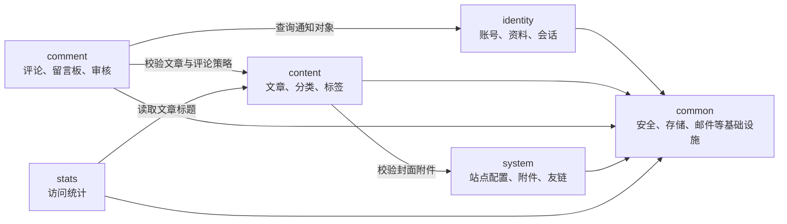
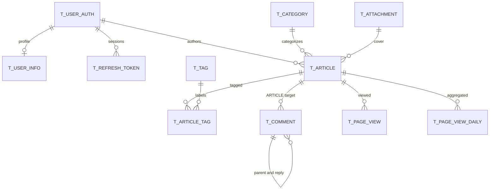

# 领域与数据关系图

> 状态：当前有效
> 适用范围：MyBlog V2 模块协作与 14 张业务表
> 最后校准：2026-07-10
> 对应代码：`MyBlog-springboot-v2/src/main/java/`、`MyBlog-springboot-v2/src/main/resources/db/migration/`
> 权威程度：关系视图

## 模块协作

箭头表示通过 application 能力或 common 抽象形成的允许依赖，不表示直接访问其他模块的 infrastructure。

## 表关系

`t_site_config`、`t_friend_link` 和 `t_mail_log` 是独立表。所有关系都是应用维护的逻辑引用，不是数据库 `FOREIGN KEY`；实际列、索引和例外规则见 `../architecture/schema-design.md`。
