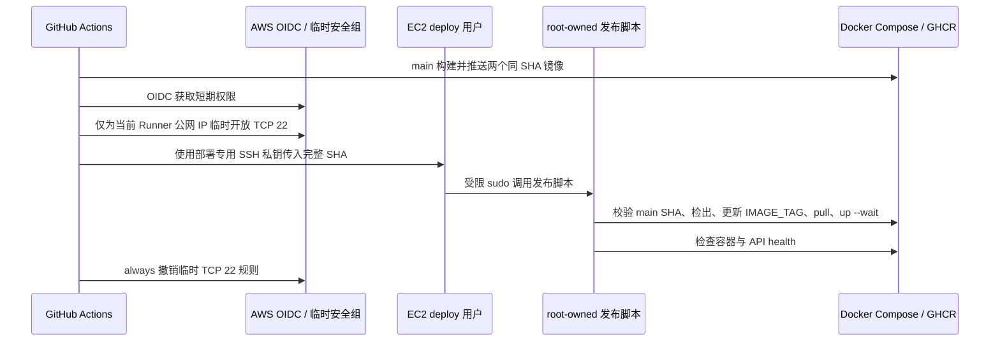

# GitHub Actions SSH 自动部署设计

> 状态：已确认，待用户审阅规格后实施  
> 日期：2026-07-12  
> 范围：MyBlog V2 单 EC2、GitHub Hosted Runner、GHCR 与 Docker Compose

## 目标

每次 main 提交成功发布 myblog-api 与 myblog-web 的同 SHA 镜像后，自动将该 SHA 部署到唯一生产 EC2。部署不保存数据库、JWT、S3 或 AWS 长期密钥到 GitHub，也不永久放宽现有 SSH 入站规则。

## 不做的事

- 不引入 Kubernetes、ECS、ECR、Watchtower、第三方隧道或自托管 Runner。
- 不开放 MySQL 3306 或 API 8080。
- 不自动回滚数据库 schema；Flyway 迁移失败时停止并保留现场。
- 不自动执行数据库备份或清理旧镜像、卷与 V1 回滚材料。
- 不把 runtime.env、管理员密码或私钥写入仓库、镜像或工作流日志。

## 架构

## GitHub 工作流

在现有 images.yml 的 publish job 后增加 deploy job，而不是创建第二条事件链：

- 仅当 github.ref 是 main 且 publish 成功时运行。
- 以同一 github.sha 为唯一发布版本，保证代码、API 镜像、Web 镜像与 IMAGE_TAG 一致。
- 使用 GitHub Environment production；Environment 仅允许 main 部署，存放部署 SSH 私钥、主机、端口、用户与 host key。
- 使用 concurrency 组 myblog-production，cancel-in-progress 为 false，避免两个发布并发修改同一 Compose 栈。
- permissions 除 contents: read、packages: write 外，deploy job 增加 id-token: write；不用 AWS Access Key。
- 先取得当前 Runner 公网 IPv4，再添加临时安全组规则；SSH 完成后以 always 步骤撤销该规则。
- SSH 使用 StrictHostKeyChecking=yes 与 GitHub Environment 中保存的 known_hosts；绝不关闭主机密钥校验。

## AWS OIDC 与安全组

创建 GitHub OIDC provider（如账户内尚不存在）和角色 MyBlogGitHubCdRole：

- 信任条件只允许仓库 tongchang01/My-Blog 的 production environment 获取 token。
- 角色只用于 EC2 安全组的 Describe、AuthorizeSecurityGroupIngress、RevokeSecurityGroupIngress。
- 新建独立安全组 myblog-github-cd-ssh，常态不含入站规则，并附加到当前 EC2。
- 工作流只在该独立安全组中临时添加 current-runner-ip/32 的 TCP 22 规则。
- 原 default 安全组中“维护者固定 IP 的 22”规则不改动；80/443、3306/8080 的边界不因 CD 改变。

独立安全组使 OIDC 角色即使被误用，也不会修改生产 Web 端口或日常 SSH 规则。规则撤销失败会使工作流失败并留下可审计记录，维护者需按 run ID 手工复核该组。

## 服务器部署入口

新增 deploy 用户，不复用日常 ec2-user 登录密钥：

1. deploy 用户仅接收一把 GitHub CD 专用公钥。
2. authorized_keys 使用 restrict、no-pty、no-agent-forwarding、no-port-forwarding、no-X11-forwarding 和 forced command。
3. forced command 读取 SSH_ORIGINAL_COMMAND，只接受一个完整 40 位 Git SHA。
4. deploy 用户只有对 root-owned /usr/local/sbin/myblog-release 的免密 sudo；不得拥有通用 sudo、docker group 或交互式 root 权限。
5. 发布脚本以 root 执行 Docker，以 deploy 身份执行 Git；/opt/myblog-v2 转为 deploy 所有，避免发布时使用 Git root 身份。
6. 脚本 fetch origin，验证 SHA 是 origin/main 的祖先，再 detach checkout。
7. 脚本只替换 runtime.env 的 IMAGE_TAG 一行，不打印文件内容；随后执行 compose config --quiet、pull、up -d --wait。
8. 成功标准：mysql、api、web 均 healthy，容器内 API actuator health 返回 UP。
9. 脚本把时间、SHA、结果写入 root-only 日志；日志不得包含秘密。

## 失败与回滚边界

- SSH、Git、Compose 配置、拉镜像、健康检查任一步失败，发布脚本返回非零，GitHub deployment 标红。
- 失败不自动回滚：数据库 Flyway 可能已升级，镜像回滚无法安全回滚 schema。
- 工作流无论部署结果都撤销临时 SSH /32；若撤销失败，run 标红并在操作手册中给出手工撤销命令。
- 人工回滚仍使用已验证 main SHA、同 SHA 镜像与既有 production runbook；必须先判断数据库迁移兼容性。

## 验证策略

1. Shell 单元测试先覆盖：SHA 格式拒绝、非 main 提交拒绝、失败时不修改 IMAGE_TAG、成功路径的命令顺序。
2. 工作流静态检查：deploy job 依赖 publish、main 条件、production environment、concurrency、OIDC 最小 permissions 与 always 撤销步骤。
3. 服务器预检：deploy 用户不能获取通用 sudo，错误 SHA 被拒绝，正确 SHA 可完成 dry-run。
4. 首次真实演练：手动 workflow dispatch 到当前已验证 SHA，观察临时 SSH 规则创建与撤销、服务健康、GitHub deployment 记录。
5. 演练完成后再允许后续 main 推送自动部署。

## 文档同步

实现时更新 deployment-direction、ci-cd、production-runbook、release-checklist 与仓库外维护交接文档，明确 CD 已启用、回滚边界和临时安全组排查方式。

